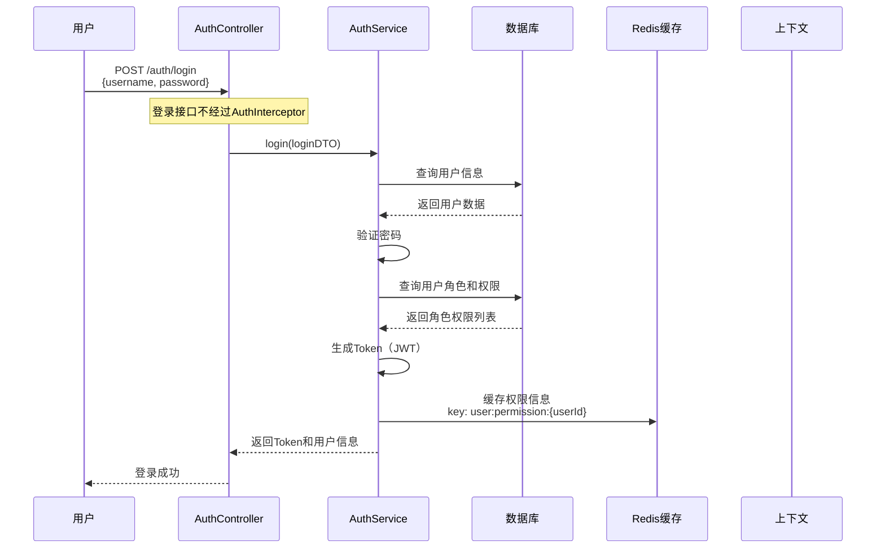
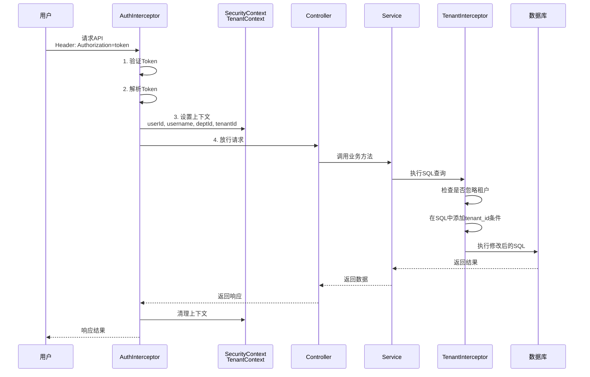
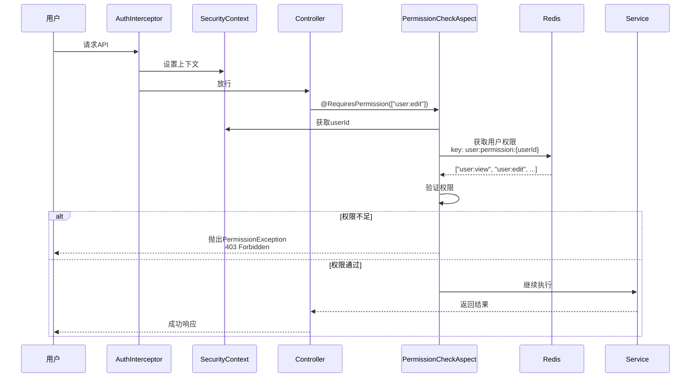
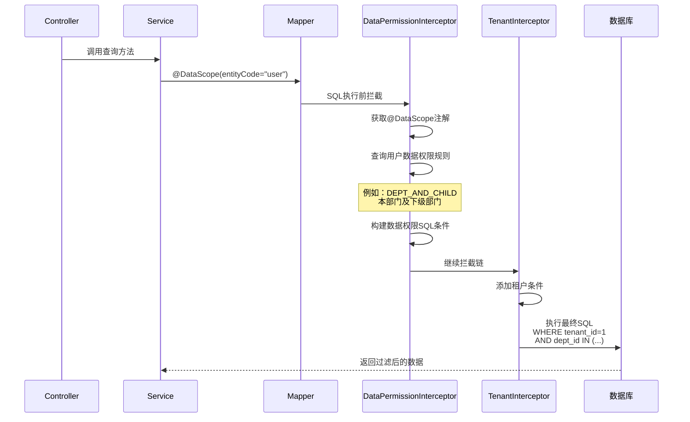
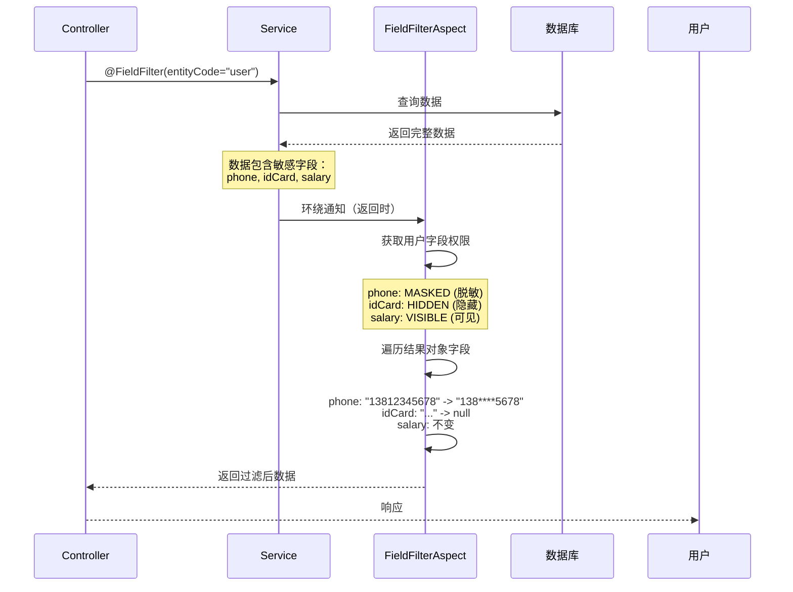
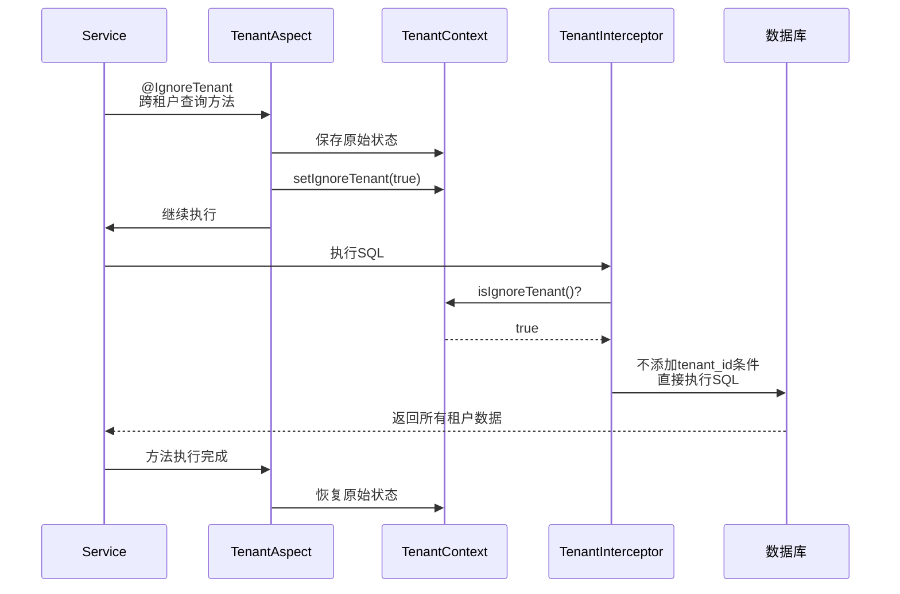

# Base项目授权认证流程详细说明

## 目录
- [概述](#概述)
- [整体架构](#整体架构)
- [核心组件](#核心组件)
- [完整流程](#完整流程)
- [各组件详细说明](#各组件详细说明)
- [执行顺序总结](#执行顺序总结)

---

## 概述

Base项目采用多层次的权限控制体系，实现了细粒度的授权认证机制。整个系统包含以下几个层次的权限控制：

1. **身份认证**：验证用户是否登录（Web拦截器）
2. **租户隔离**：多租户数据隔离（MyBatis拦截器 + 切面）
3. **功能权限**：控制用户能访问哪些功能（切面）
4. **数据权限**：控制用户能访问哪些数据（MyBatis拦截器）
5. **字段权限**：控制用户能看到哪些字段（切面）
6. **操作日志**：记录敏感操作（切面）

---

## 整体架构

```mermaid
graph TB
    A[用户请求] --> B[AuthInterceptor<br/>认证拦截器]
    B -->|认证失败| C[返回401]
    B -->|认证成功| D[设置SecurityContext<br/>TenantContext]
    D --> E[Controller层]
    E --> F{是否有@RequiresPermission}
    F -->|有| G[PermissionCheckAspect<br/>权限校验切面]
    F -->|无| H[Service层]
    G -->|权限不足| I[抛PermissionException]
    G -->|权限通过| H
    H --> J{是否有@IgnoreTenant}
    J -->|有| K[TenantAspect<br/>设置忽略租户]
    J -->|无| L[继续执行]
    K --> L
    L --> M[Mapper层]
    M --> N{是否有@DataScope}
    N -->|有| O[DataPermissionInterceptor<br/>数据权限拦截]
    N -->|无| P[TenantInterceptor<br/>租户拦截]
    O --> P
    P --> Q[执行SQL]
    Q --> R[返回结果]
    R --> S{是否有@FieldFilter}
    S -->|有| T[FieldFilterAspect<br/>字段过滤]
    S -->|无| U[原始结果]
    T --> V[过滤后结果]
    V --> W[返回给前端]
    U --> W
    W --> X[AuthInterceptor.afterCompletion<br/>清理上下文]
```


---

## 核心组件

### 1. 上下文管理

#### SecurityContext（安全上下文）
- **位置**：`cn.kmdckj.base.common.context.SecurityContext`
- **作用**：存储当前登录用户信息
- **使用技术**：`TransmittableThreadLocal`（支持线程池传递）
- **存储内容**：
  - `userId`：用户ID
  - `username`：用户名
  - `deptId`：部门ID

#### TenantContext（租户上下文）
- **位置**：`cn.kmdckj.base.common.context.TenantContext`
- **作用**：存储当前租户信息
- **存储内容**：
  - `tenantId`：租户ID
  - `ignoreTenant`：是否忽略租户隔离

### 2. Web拦截器

#### AuthInterceptor（认证拦截器）
- **位置**：`cn.kmdckj.base.interceptor.AuthInterceptor`
- **执行时机**：请求进入Controller之前
- **主要职责**：
  1. 验证Token是否存在
  2. 解析Token获取用户信息
  3. 将用户信息设置到上下文
  4. 清理上下文（请求完成后）

### 3. MyBatis拦截器

#### TenantInterceptor（租户拦截器）
- **位置**：`cn.kmdckj.base.interceptor.TenantInterceptor`
- **执行时机**：SQL执行之前
- **主要职责**：
  1. 自动在SQL中添加`tenant_id`条件
  2. 实现租户数据隔离
  3. 支持通过`@IgnoreTenant`注解跳过

#### DataPermissionInterceptor（数据权限拦截器）
- **位置**：`cn.kmdckj.base.interceptor.DataPermissionInterceptor`
- **执行时机**：SQL执行之前
- **主要职责**：
  1. 根据`@DataScope`注解获取实体信息
  2. 查询用户的数据权限规则
  3. 在SQL中添加数据范围条件

### 4. AOP切面

#### PermissionCheckAspect（权限校验切面）
- **位置**：`cn.kmdckj.base.aspect.PermissionCheckAspect`
- **拦截注解**：`@RequiresPermission`
- **执行时机**：方法执行之前
- **主要职责**：
  1. 获取方法所需权限码
  2. 从缓存/数据库查询用户权限
  3. 验证用户是否拥有所需权限

#### TenantAspect（租户切面）
- **位置**：`cn.kmdckj.base.aspect.TenantAspect`
- **拦截注解**：`@IgnoreTenant`
- **执行时机**：方法执行前后（环绕）
- **优先级**：最高（@Order(1)）
- **主要职责**：临时设置忽略租户隔离标志

#### FieldFilterAspect（字段过滤切面）
- **位置**：`cn.kmdckj.base.aspect.FieldFilterAspect`
- **拦截注解**：`@FieldFilter`
- **执行时机**：方法执行后（环绕）
- **主要职责**：
  1. 获取用户的字段权限
  2. 对返回结果进行字段过滤
  3. 支持字段隐藏和脱敏

#### DataAccessLogAspect（数据访问日志切面）
- **位置**：`cn.kmdckj.base.aspect.DataAccessLogAspect`
- **拦截注解**：`@DataScope`或`@Log`
- **执行时机**：方法执行前后（环绕）
- **主要职责**：
  1. 记录方法执行时间
  2. 记录请求参数和响应结果
  3. 异步保存到日志表

### 5. 注解

| 注解 | 作用范围 | 功能 |
|-----|---------|------|
| `@RequiresPermission` | 方法 | 功能权限校验 |
| `@DataScope` | 方法 | 数据权限控制 |
| `@FieldFilter` | 方法 | 字段权限过滤 |
| `@IgnoreTenant` | 方法/类 | 忽略租户隔离 |
| `@Log` | 方法 | 操作日志记录 |

---

## 完整流程

### 用户登录流程



### 普通请求流程（无特殊权限要求）



### 带权限校验的请求流程



### 带数据权限的请求流程



### 带字段权限的请求流程



### 忽略租户隔离的流程



---

## 各组件详细说明

### 1. AuthInterceptor（认证拦截器）

**配置位置**：`WebMvcConfig.addInterceptors()`

**拦截路径**：
- 拦截所有路径：`/**`
- 排除路径：
  - `/auth/login` - 登录接口
  - `/auth/logout` - 登出接口
  - `/error` - 错误页面
  - `/doc.html` - 接口文档
  - `/swagger-resources/**` - Swagger资源
  - `/v3/api-docs/**` - OpenAPI文档

**执行流程**：

```java
// 1. preHandle - 前置处理
public boolean preHandle(HttpServletRequest request, HttpServletResponse response, Object handler) {
    // 1.1 获取Token
    String token = request.getHeader("Authorization");
    
    // 1.2 验证Token是否存在
    if (token == null || token.isEmpty()) {
        // 返回401未授权
        response.setStatus(401);
        return false;
    }
    
    // 1.3 解析Token（实际需要JWT解析或Redis查询）
    // TODO: 实际实现
    Long userId = parseUserId(token);
    String username = parseUsername(token);
    Long tenantId = parseTenantId(token);
    Long deptId = parseDeptId(token);
    
    // 1.4 设置上下文
    SecurityContext.setUserId(userId);
    SecurityContext.setUsername(username);
    SecurityContext.setDeptId(deptId);
    TenantContext.setTenantId(tenantId);
    
    return true;
}

// 2. postHandle - 后置处理
public void postHandle(...) {
    // 可以在这里记录访问日志
}

// 3. afterCompletion - 完成后处理
public void afterCompletion(...) {
    // 清除上下文，避免内存泄漏
    SecurityContext.clear();
    TenantContext.clear();
}
```

**关键点**：
- 使用`ThreadLocal`存储用户信息，线程隔离
- 必须在`afterCompletion`中清理上下文
- Token解析失败直接返回401

---

### 2. PermissionCheckAspect（权限校验切面）

**触发条件**：方法上有`@RequiresPermission`注解

**注解示例**：
```java
// 单个权限（OR逻辑）
@RequiresPermission("user:edit")
public void updateUser(UserDTO user) { }

// 多个权限（OR逻辑，满足其一即可）
@RequiresPermission({"user:edit", "user:admin"})
public void updateUser(UserDTO user) { }

// 多个权限（AND逻辑，必须全部拥有）
@RequiresPermission(value = {"user:edit", "dept:view"}, logical = RequiresPermission.Logical.AND)
public void updateUserDept(UserDTO user) { }
```

**执行逻辑**：

```java
@Before("@annotation(cn.kmdckj.base.annotation.RequiresPermission)")
public void checkPermission(JoinPoint joinPoint) {
    // 1. 获取当前用户
    Long userId = SecurityContext.getUserId();
    if (userId == null) {
        throw new PermissionException("用户未登录");
    }
    
    // 2. 获取方法所需权限
    RequiresPermission annotation = method.getAnnotation(RequiresPermission.class);
    String[] requiredPermissions = annotation.value();
    
    // 3. 获取用户拥有的权限（从缓存或数据库）
    Set<String> userPermissions = getUserPermissions(userId);
    
    // 4. 验证权限
    boolean hasPermission;
    if (annotation.logical() == Logical.AND) {
        // AND：需要拥有所有权限
        hasPermission = userPermissions.containsAll(Arrays.asList(requiredPermissions));
    } else {
        // OR：拥有任意一个权限即可
        hasPermission = Arrays.stream(requiredPermissions)
            .anyMatch(userPermissions::contains);
    }
    
    // 5. 权限不足则抛异常
    if (!hasPermission) {
        throw new PermissionException("权限不足");
    }
}
```

**权限缓存机制**：
- 缓存Key：`base:user:permission:{userId}`
- 缓存内容：用户拥有的所有权限码集合
- 缓存策略：
  1. 优先从Redis获取
  2. 缓存不存在时查询数据库
  3. 查询逻辑：用户 → 角色 → 权限

---

### 3. TenantInterceptor（租户拦截器）

**作用**：自动在SQL中添加`tenant_id`条件，实现数据隔离

**不需要租户隔离的表**：
- `tenant` - 租户表本身
- `operation` - 操作表（平台级）
- `data_access_log` - 日志表
- `grant_operation_log` - 授权日志表

**执行逻辑**：

```java
@Override
public void beforeQuery(Executor executor, MappedStatement ms, ...) {
    // 1. 检查是否忽略租户
    if (TenantContext.isIgnoreTenant()) {
        return; // 跳过处理
    }
    
    // 2. 检查方法是否有@IgnoreTenant注解
    if (hasIgnoreTenantAnnotation(ms)) {
        return;
    }
    
    // 3. 获取当前租户ID
    Long tenantId = TenantContext.getTenantId();
    if (tenantId == null) {
        log.warn("租户ID为空");
        return;
    }
    
    // 4. 解析SQL并添加租户条件（实际需要JSQLParser）
    // 示例：SELECT * FROM user WHERE ...
    // 变为：SELECT * FROM user WHERE tenant_id = 1 AND ...
}
```

**SQL修改示例**：
```sql
-- 原始SQL
SELECT * FROM user WHERE status = 1;

-- 自动添加租户条件后
SELECT * FROM user WHERE tenant_id = 1 AND status = 1;

-- 原始SQL（带JOIN）
SELECT u.*, d.name FROM user u LEFT JOIN department d ON u.dept_id = d.id;

-- 自动添加租户条件后
SELECT u.*, d.name FROM user u 
LEFT JOIN department d ON u.dept_id = d.id 
WHERE u.tenant_id = 1 AND d.tenant_id = 1;
```

---

### 4. DataPermissionInterceptor（数据权限拦截器）

**触发条件**：Mapper方法上有`@DataScope`注解

**数据权限类型**（`DataScopeType`）：
1. `ALL` - 本租户全部数据
2. `DEPT` - 本部门数据
3. `DEPT_AND_CHILD` - 本部门及下级部门数据
4. `SELF` - 仅本人数据
5. `CUSTOM` - 自定义部门范围

**使用示例**：
```java
@Mapper
public interface UserMapper {
    // 查询用户列表，应用数据权限
    @DataScope(entityCode = "user", entityAlias = "u")
    List<User> selectList(@Param("query") UserQueryDTO query);
}
```

**SQL修改示例**：
```sql
-- 原始SQL
SELECT * FROM user u WHERE u.status = 1;

-- DEPT（本部门）
SELECT * FROM user u WHERE u.tenant_id = 1 AND u.dept_id = 2 AND u.status = 1;

-- DEPT_AND_CHILD（本部门及下级）
SELECT * FROM user u 
WHERE u.tenant_id = 1 
  AND u.dept_id IN (SELECT id FROM department WHERE dept_path LIKE '%/2/%') 
  AND u.status = 1;

-- SELF（仅本人）
SELECT * FROM user u 
WHERE u.tenant_id = 1 
  AND u.create_user_id = 100 
  AND u.status = 1;
```

**权限规则查询**：
1. 根据`userId`查询用户的所有角色
2. 根据角色查询`data_permission_rule`表
3. 根据`entityCode`过滤规则
4. 取最宽松的权限（例如：同时有DEPT和ALL，取ALL）

---

### 5. FieldFilterAspect（字段过滤切面）

**触发条件**：方法上有`@FieldFilter`注解

**字段权限类型**（`FieldPermissionType`）：
1. `VISIBLE` - 可见
2. `HIDDEN` - 隐藏（设置为null）
3. `MASKED` - 脱敏显示
4. `EDITABLE` - 可编辑（前端控制）

**使用示例**：
```java
@Service
public class UserService {
    @FieldFilter(entityCode = "user")
    public Result<List<UserVO>> getUserList(UserQueryDTO query) {
        // 查询用户列表
        List<UserVO> users = userMapper.selectList(query);
        return Result.success(users);
    }
}
```

**过滤示例**：

原始数据：
```json
{
  "id": 1,
  "username": "zhangsan",
  "realName": "张三",
  "phone": "13812345678",
  "idCard": "110101199001011234",
  "email": "zhangsan@example.com",
  "salary": 15000
}
```

假设用户的字段权限为：
- `phone`: MASKED（脱敏）
- `idCard`: HIDDEN（隐藏）
- `salary`: HIDDEN（隐藏）
- 其他字段：VISIBLE（可见）

过滤后数据：
```json
{
  "id": 1,
  "username": "zhangsan",
  "realName": "张三",
  "phone": "138****5678",
  "idCard": null,
  "email": "zhangsan@example.com",
  "salary": null
}
```

**脱敏规则**（基于`MaskUtil`）：
- 手机号：`138****5678`
- 身份证：`110101********1234`
- 邮箱：`zha****@example.com`
- 银行卡：`6222 **** **** 1234`

---

### 6. TenantAspect（租户切面）

**触发条件**：方法或类上有`@IgnoreTenant`注解

**使用场景**：
- 平台管理员跨租户查询
- 系统初始化数据
- 定时任务批量处理

**使用示例**：
```java
@Service
public class PlatformService {
    // 平台管理员查看所有租户统计
    @IgnoreTenant
    public List<TenantStatVO> getAllTenantStats() {
        return tenantMapper.selectAllStats();
    }
}
```

**执行逻辑**：
```java
@Around("@annotation(...) || @within(...)")
public Object handleIgnoreTenant(ProceedingJoinPoint joinPoint) {
    // 1. 保存原始状态
    Boolean originalIgnore = TenantContext.isIgnoreTenant();
    
    try {
        // 2. 设置忽略租户隔离
        TenantContext.setIgnoreTenant(true);
        
        // 3. 执行方法
        return joinPoint.proceed();
    } finally {
        // 4. 恢复原始状态
        TenantContext.setIgnoreTenant(originalIgnore);
    }
}
```

**优先级**：`@Order(1)` - 最高优先级，确保在其他切面之前执行

---

### 7. DataAccessLogAspect（数据访问日志切面）

**触发条件**：方法上有`@DataScope`或`@Log`注解

**使用示例**：
```java
@Service
public class UserService {
    @Log(module = "用户管理", 
         type = OperationType.UPDATE, 
         description = "修改用户信息",
         saveRequest = true,
         saveResponse = false)
    public void updateUser(UserDTO userDTO) {
        userMapper.updateById(userDTO);
    }
}
```

**记录内容**：
1. **用户信息**：userId, username, tenantId
2. **请求信息**：URL, 请求方法, IP地址, User-Agent
3. **方法信息**：类名, 方法名
4. **操作信息**：模块, 操作类型, 描述
5. **参数和结果**：请求参数, 响应数据（可选）
6. **时间信息**：访问时间, 响应时间(ms)
7. **异常信息**：异常类型, 异常消息（如果有）

**异步处理**：
- 使用`@Async("logTaskExecutor")`异步保存日志
- 不影响主业务性能
- 异常不会影响业务方法

---

## 执行顺序总结

### 单次请求完整执行顺序

```
1. 【Web层】AuthInterceptor.preHandle
   ├─ 验证Token
   ├─ 解析用户信息
   └─ 设置SecurityContext、TenantContext

2. 【Controller层】接收请求

3. 【切面】TenantAspect (@IgnoreTenant) [如果有]
   └─ 设置忽略租户标志

4. 【切面】PermissionCheckAspect (@RequiresPermission) [如果有]
   ├─ 获取用户权限
   └─ 验证权限

5. 【Service层】执行业务逻辑

6. 【切面】DataAccessLogAspect (@Log/@DataScope) [如果有]
   └─ 记录方法开始时间

7. 【Mapper层】执行数据库操作

8. 【MyBatis拦截器】DataPermissionInterceptor (@DataScope) [如果有]
   ├─ 获取数据权限规则
   └─ 修改SQL添加数据范围条件

9. 【MyBatis拦截器】TenantInterceptor
   ├─ 检查是否忽略租户
   ├─ 检查表是否需要租户隔离
   └─ 修改SQL添加tenant_id条件

10. 【数据库】执行最终SQL

11. 【返回数据】从数据库返回结果

12. 【切面】FieldFilterAspect (@FieldFilter) [如果有]
    ├─ 获取字段权限
    ├─ 遍历结果对象
    ├─ 隐藏/脱敏字段
    └─ 返回过滤后数据

13. 【切面】DataAccessLogAspect
    ├─ 计算响应时间
    └─ 异步保存日志

14. 【切面】TenantAspect
    └─ 恢复租户隔离状态

15. 【Controller层】返回响应

16. 【Web层】AuthInterceptor.postHandle
    └─ 后置处理（可选）

17. 【Web层】AuthInterceptor.afterCompletion
    ├─ 清除SecurityContext
    └─ 清除TenantContext

18. 【返回】响应到用户
```

### 优先级说明

**切面执行顺序**（由外到内）：
1. `TenantAspect` (Order=1) - 最先执行
2. `PermissionCheckAspect` - 权限校验
3. `DataAccessLogAspect` - 日志记录（环绕）
4. `FieldFilterAspect` - 字段过滤（环绕，返回时执行）

**MyBatis拦截器顺序**：
1. `DataPermissionInterceptor` - 数据权限
2. `TenantInterceptor` - 租户隔离

---

## 配置要点

### 1. WebMvcConfig配置拦截器

```java
@Configuration
public class WebMvcConfig implements WebMvcConfigurer {
    @Autowired
    private AuthInterceptor authInterceptor;
    
    @Override
    public void addInterceptors(InterceptorRegistry registry) {
        registry.addInterceptor(authInterceptor)
                .addPathPatterns("/**")
                .excludePathPatterns("/auth/login", "/auth/logout", ...);
    }
}
```

### 2. MybatisPlusConfig配置拦截器

```java
@Configuration
public class MybatisPlusConfig {
    @Bean
    public MybatisPlusInterceptor mybatisPlusInterceptor() {
        MybatisPlusInterceptor interceptor = new MybatisPlusInterceptor();

        // 租户拦截器
        interceptor.addInnerInterceptor(new TenantInterceptor());
        
        // 数据权限拦截器
        interceptor.addInnerInterceptor(new DataPermissionInterceptor());
              
        // 分页拦截器
        interceptor.addInnerInterceptor(new PaginationInnerInterceptor());
        
        return interceptor;
    }
}
```

### 3. 线程池配置（用于异步日志）

```java
@Configuration
public class ThreadPoolConfig {
    @Bean("logTaskExecutor")
    public Executor logTaskExecutor() {
        ThreadPoolTaskExecutor executor = new ThreadPoolTaskExecutor();
        executor.setCorePoolSize(2);
        executor.setMaxPoolSize(5);
        executor.setQueueCapacity(100);
        executor.setThreadNamePrefix("log-");
        executor.initialize();
        return executor;
    }
}
```

---

## 常见使用场景

### 场景1：普通查询（租户隔离 + 数据权限）

```java
@RestController
@RequestMapping("/user")
public class UserController {
    @Autowired
    private UserService userService;
    
    @GetMapping("/list")
    @RequiresPermission("user:view")
    public Result<List<UserVO>> list(UserQueryDTO query) {
        return userService.list(query);
    }
}

@Service
public class UserService {
    @Autowired
    private UserMapper userMapper;
    
    @FieldFilter(entityCode = "user")
    public Result<List<UserVO>> list(UserQueryDTO query) {
        List<User> users = userMapper.selectList(query);
        return Result.success(BeanUtil.copyToList(users, UserVO.class));
    }
}

@Mapper
public interface UserMapper {
    @DataScope(entityCode = "user", entityAlias = "u")
    List<User> selectList(@Param("query") UserQueryDTO query);
}
```

**执行流程**：
1. AuthInterceptor验证登录，设置上下文
2. PermissionCheckAspect校验`user:view`权限
3. 执行selectList方法
4. DataPermissionInterceptor添加数据权限条件（例如：本部门）
5. TenantInterceptor添加租户条件
6. 执行SQL获取数据
7. FieldFilterAspect过滤敏感字段
8. 返回结果

### 场景2：跨租户查询（平台管理员）

```java
@Service
public class PlatformService {
    @IgnoreTenant
    @RequiresPermission("platform:admin")
    public List<TenantVO> getAllTenants() {
        return tenantMapper.selectAll();
    }
}
```

**执行流程**：
1. 权限校验：验证平台管理员权限
2. TenantAspect设置忽略租户
3. 执行selectAll
4. TenantInterceptor检测到忽略标志，不添加tenant_id条件
5. 返回所有租户数据

### 场景3：敏感操作日志

```java
@Service
public class UserService {
    @Log(module = "用户管理",
         type = OperationType.DELETE,
         description = "删除用户",
         saveRequest = true)
    @RequiresPermission("user:delete")
    public void deleteUser(Long userId) {
        userMapper.deleteById(userId);
    }
}
```

**执行流程**：
1. 权限校验
2. DataAccessLogAspect记录开始时间
3. 执行删除操作
4. DataAccessLogAspect异步保存日志（包含操作人、时间、参数等）

---

## 总结

Base项目的授权认证系统通过多层次的拦截和切面，实现了：

1. **身份认证**：通过Web拦截器验证Token
2. **租户隔离**：通过MyBatis拦截器自动隔离数据
3. **功能权限**：通过AOP切面校验权限码
4. **数据权限**：通过MyBatis拦截器控制数据范围
5. **字段权限**：通过AOP切面过滤敏感字段
6. **操作审计**：通过AOP切面记录操作日志

整个流程清晰、模块化，各组件职责明确，易于维护和扩展。
