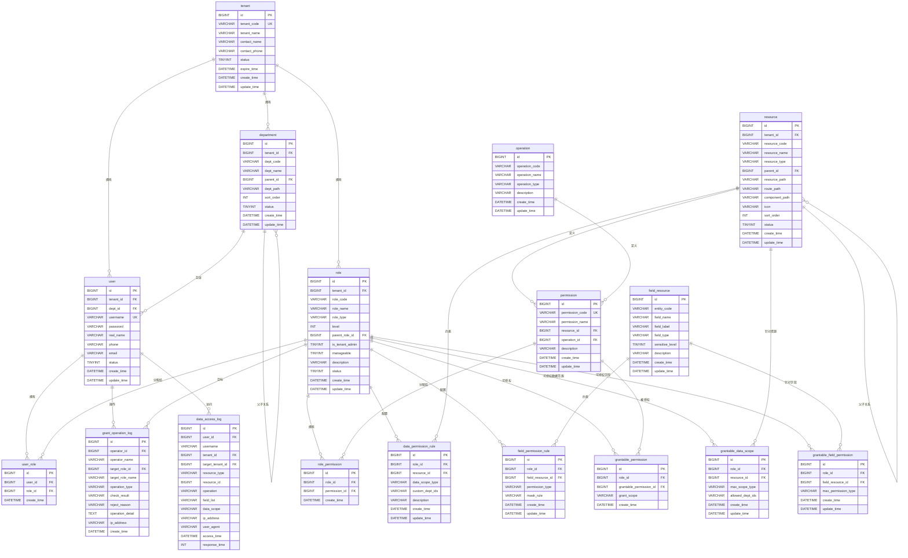

# 多租户细粒度RBAC权限系统设计方案

## 一、概述

### 1.1 设计目标

- 支持多租户架构，租户间数据完全隔离
- 实现细粒度RBAC权限控制
- 支持平台管理员跨租户管理
- 支持租户超管管理本租户所有数据
- 支持部门级、个人级数据权限控制
- 支持字段级权限控制
- 支持授权不越权机制

### 1.2 技术栈

- 前端：Vue3 + Element Plus
- 后端：Java + Spring Boot + MyBatis Plus
- 数据库：MySQL
- 缓存：Redis

### 1.3 核心特性

- 功能权限：控制菜单、按钮、API访问
- 数据权限：本租户全部、本部门、本部门及下级、仅自己、自定义部门
- 字段权限：隐藏、可见、可编辑、脱敏显示
- 授权控制：角色层级、权限范围、数据范围、字段权限的授权边界控制

## 二、整体架构

### 2.1 租户隔离策略

**数据库方案**
- 采用共享数据库 + 共享表 + tenant_id字段方案
- 所有业务表添加tenant_id字段
- 通过MyBatis拦截器自动注入租户过滤条件

**优势**
- 成本低，便于维护
- 扩展性好
- 数据备份恢复简单

### 2.2 权限模型

**四层权限体系**
1. 功能权限：资源 + 操作 = 权限点
2. 数据权限：角色 + 资源 + 数据范围 = 可访问数据
3. 字段权限：角色 + 字段 + 权限类型 = 字段访问控制
4. 授权权限：角色层级 + 可授权范围 = 授权边界

### 2.3 角色层级
```
层级0   : 平台超级管理员 (可跨租户管理)
层级10  : 平台运营管理员 (可跨租户查看)
层级100 : 租户超级管理员 (本租户全部权限)
层级200 : 租户部门管理员 (本部门权限)
层级300 : 租户普通角色   (受限权限)
```

## 三、数据表设计

### 3.1 基础表

#### tenant (租户表)
| 字段名 | 类型 | 说明 |
|--------|------|------|
| id | BIGINT | 主键 |
| tenant_code | VARCHAR(50) | 租户编码，唯一 |
| tenant_name | VARCHAR(100) | 租户名称 |
| contact_name | VARCHAR(50) | 联系人 |
| contact_phone | VARCHAR(20) | 联系电话 |
| status | TINYINT | 状态：0-禁用 1-启用 |
| expire_time | DATETIME | 过期时间 |
| create_time | DATETIME | 创建时间 |
| update_time | DATETIME | 更新时间 |

#### department (部门表)
| 字段名 | 类型 | 说明 |
|--------|------|------|
| id | BIGINT | 主键 |
| tenant_id | BIGINT | 租户ID |
| dept_code | VARCHAR(50) | 部门编码 |
| dept_name | VARCHAR(100) | 部门名称 |
| parent_id | BIGINT | 父部门ID，0为根部门 |
| dept_path | VARCHAR(500) | 部门路径，如/1/2/5/ |
| sort_order | INT | 排序 |
| status | TINYINT | 状态：0-禁用 1-启用 |
| create_time | DATETIME | 创建时间 |
| update_time | DATETIME | 更新时间 |

#### user (用户表)
| 字段名 | 类型 | 说明 |
|--------|------|------|
| id | BIGINT | 主键 |
| tenant_id | BIGINT | 租户ID |
| dept_id | BIGINT | 部门ID |
| username | VARCHAR(50) | 用户名，唯一 |
| password | VARCHAR(100) | 密码(加密) |
| real_name | VARCHAR(50) | 真实姓名 |
| phone | VARCHAR(20) | 手机号 |
| email | VARCHAR(100) | 邮箱 |
| status | TINYINT | 状态：0-禁用 1-启用 |
| create_time | DATETIME | 创建时间 |
| update_time | DATETIME | 更新时间 |

#### role (角色表)
| 字段名 | 类型 | 说明 |
|--------|------|------|
| id | BIGINT | 主键 |
| tenant_id | BIGINT | 租户ID，平台角色为NULL |
| role_code | VARCHAR(50) | 角色编码 |
| role_name | VARCHAR(100) | 角色名称 |
| role_type | VARCHAR(20) | 角色类型：platform-平台 tenant-租户 |
| level | INT | 角色层级，数字越小权限越大 |
| parent_role_id | BIGINT | 父角色ID，用于继承 |
| is_tenant_admin | TINYINT | 是否租户管理员：0-否 1-是 |
| manageable | TINYINT | 是否可被管理：0-否 1-是 |
| description | VARCHAR(500) | 描述 |
| status | TINYINT | 状态：0-禁用 1-启用 |
| create_time | DATETIME | 创建时间 |
| update_time | DATETIME | 更新时间 |

#### user_role (用户角色关联表)
| 字段名 | 类型 | 说明 |
|--------|------|------|
| id | BIGINT | 主键 |
| user_id | BIGINT | 用户ID |
| role_id | BIGINT | 角色ID |
| create_time | DATETIME | 创建时间 |

### 3.2 资源权限表

#### resource (资源表)
| 字段名 | 类型 | 说明 |
|--------|------|------|
| id | BIGINT | 主键 |
| tenant_id | BIGINT | 租户ID，平台资源为NULL |
| resource_code | VARCHAR(100) | 资源编码 |
| resource_name | VARCHAR(100) | 资源名称 |
| resource_type | VARCHAR(20) | 资源类型：menu-菜单 button-按钮 api-接口 entity-实体 |
| parent_id | BIGINT | 父资源ID |
| resource_path | VARCHAR(500) | 资源路径 |
| route_path | VARCHAR(200) | 前端路由路径(菜单类型) |
| component_path | VARCHAR(200) | 组件路径(菜单类型) |
| icon | VARCHAR(100) | 图标 |
| sort_order | INT | 排序 |
| status | TINYINT | 状态：0-禁用 1-启用 |
| create_time | DATETIME | 创建时间 |
| update_time | DATETIME | 更新时间 |

#### operation (操作表)
| 字段名 | 类型 | 说明 |
|--------|------|------|
| id | BIGINT | 主键 |
| operation_code | VARCHAR(50) | 操作编码 |
| operation_name | VARCHAR(100) | 操作名称 |
| operation_type | VARCHAR(20) | 操作类型：basic-基础 business-业务 |
| description | VARCHAR(500) | 描述 |
| create_time | DATETIME | 创建时间 |
| update_time | DATETIME | 更新时间 |

**预置操作数据**
```
view    - 查看
create  - 新增
update  - 修改
delete  - 删除
export  - 导出
import  - 导入
approve - 审批
```

#### permission (权限表)
| 字段名 | 类型 | 说明 |
|--------|------|------|
| id | BIGINT | 主键 |
| permission_code | VARCHAR(100) | 权限编码，如order:view |
| permission_name | VARCHAR(100) | 权限名称 |
| resource_id | BIGINT | 资源ID |
| operation_id | BIGINT | 操作ID |
| description | VARCHAR(500) | 描述 |
| create_time | DATETIME | 创建时间 |
| update_time | DATETIME | 更新时间 |

#### role_permission (角色权限关联表)
| 字段名 | 类型 | 说明 |
|--------|------|------|
| id | BIGINT | 主键 |
| role_id | BIGINT | 角色ID |
| permission_id | BIGINT | 权限ID |
| create_time | DATETIME | 创建时间 |

### 3.3 数据权限表

#### data_permission_rule (数据权限规则表)
| 字段名 | 类型 | 说明 |
|--------|------|------|
| id | BIGINT | 主键 |
| role_id | BIGINT | 角色ID |
| resource_id | BIGINT | 资源ID(实体类型的资源) |
| data_scope_type | VARCHAR(20) | 数据范围类型 |
| custom_dept_ids | VARCHAR(1000) | 自定义部门ID列表(JSON数组) |
| description | VARCHAR(500) | 描述 |
| create_time | DATETIME | 创建时间 |
| update_time | DATETIME | 更新时间 |

**data_scope_type枚举值**
```
ALL              - 本租户全部数据
DEPT             - 本部门数据
DEPT_AND_CHILD   - 本部门及下级部门数据
SELF             - 仅本人数据
CUSTOM           - 自定义部门
```

### 3.4 字段权限表

#### field_resource (字段资源表)
| 字段名 | 类型 | 说明 |
|--------|------|------|
| id | BIGINT | 主键 |
| entity_code | VARCHAR(100) | 实体编码，如order、customer |
| field_name | VARCHAR(100) | 字段名称 |
| field_label | VARCHAR(100) | 字段标签(显示名) |
| field_type | VARCHAR(50) | 字段类型 |
| sensitive_level | TINYINT | 敏感级别：0-普通 1-敏感 2-高度敏感 |
| description | VARCHAR(500) | 描述 |
| create_time | DATETIME | 创建时间 |
| update_time | DATETIME | 更新时间 |

#### field_permission_rule (字段权限规则表)
| 字段名 | 类型 | 说明 |
|--------|------|------|
| id | BIGINT | 主键 |
| role_id | BIGINT | 角色ID |
| field_resource_id | BIGINT | 字段资源ID |
| permission_type | VARCHAR(20) | 权限类型 |
| mask_rule | VARCHAR(200) | 脱敏规则 |
| create_time | DATETIME | 创建时间 |
| update_time | DATETIME | 更新时间 |

**permission_type枚举值**
```
HIDDEN    - 隐藏(不返回该字段)
VISIBLE   - 可见(只读)
EDITABLE  - 可编辑
MASKED    - 脱敏显示
```

**mask_rule示例**
```
phone:3,4    - 手机号中间4位脱敏，保留前3后4
idcard:6,4   - 身份证保留前6后4
email:*      - 邮箱@前全部脱敏
```

### 3.5 授权控制表

#### grantable_permission (可授权权限表)
| 字段名 | 类型 | 说明 |
|--------|------|------|
| id | BIGINT | 主键 |
| role_id | BIGINT | 授权者角色ID |
| grantable_permission_id | BIGINT | 可授予的权限ID |
| grant_scope | VARCHAR(20) | 授权范围：ALL-全部 PARTIAL-部分 |
| create_time | DATETIME | 创建时间 |

#### grantable_data_scope (可授权数据范围表)
| 字段名 | 类型 | 说明 |
|--------|------|------|
| id | BIGINT | 主键 |
| role_id | BIGINT | 授权者角色ID |
| resource_id | BIGINT | 资源ID |
| max_scope_type | VARCHAR(20) | 最大可授予数据范围 |
| allowed_dept_ids | VARCHAR(2000) | 可授权的部门ID列表(JSON数组) |
| create_time | DATETIME | 创建时间 |
| update_time | DATETIME | 更新时间 |

#### grantable_field_permission (可授权字段权限表)
| 字段名 | 类型 | 说明 |
|--------|------|------|
| id | BIGINT | 主键 |
| role_id | BIGINT | 授权者角色ID |
| field_resource_id | BIGINT | 字段资源ID |
| max_permission_type | VARCHAR(20) | 最大可授予权限类型 |
| create_time | DATETIME | 创建时间 |
| update_time | DATETIME | 更新时间 |

#### grant_operation_log (授权操作日志表)
| 字段名 | 类型 | 说明 |
|--------|------|------|
| id | BIGINT | 主键 |
| operator_id | BIGINT | 操作人ID |
| operator_name | VARCHAR(50) | 操作人姓名 |
| target_role_id | BIGINT | 目标角色ID |
| target_role_name | VARCHAR(100) | 目标角色名称 |
| operation_type | VARCHAR(50) | 操作类型 |
| check_result | VARCHAR(20) | 校验结果：PASS-通过 REJECT-拒绝 |
| reject_reason | VARCHAR(500) | 拒绝原因 |
| operation_detail | TEXT | 操作详情(JSON) |
| ip_address | VARCHAR(50) | IP地址 |
| create_time | DATETIME | 操作时间 |

**operation_type枚举值**
```
CREATE_ROLE           - 创建角色
UPDATE_ROLE           - 修改角色
DELETE_ROLE           - 删除角色
ASSIGN_PERMISSION     - 分配功能权限
ASSIGN_DATA_SCOPE     - 分配数据权限
ASSIGN_FIELD_PERMISSION - 分配字段权限
ASSIGN_USER_ROLE      - 分配用户角色
```

### 3.6 审计日志表

#### data_access_log (数据访问日志表)
| 字段名 | 类型 | 说明 |
|--------|------|------|
| id | BIGINT | 主键 |
| user_id | BIGINT | 用户ID |
| username | VARCHAR(50) | 用户名 |
| tenant_id | BIGINT | 租户ID |
| target_tenant_id | BIGINT | 目标租户ID(跨租户访问时) |
| resource_type | VARCHAR(50) | 资源类型 |
| resource_id | BIGINT | 资源ID |
| operation | VARCHAR(50) | 操作 |
| field_list | VARCHAR(2000) | 访问的字段列表 |
| data_scope | VARCHAR(20) | 数据范围 |
| ip_address | VARCHAR(50) | IP地址 |
| user_agent | VARCHAR(500) | 用户代理 |
| access_time | DATETIME | 访问时间 |
| response_time | INT | 响应时间(毫秒) |

### 3.7 ER图



## 四、权限判断流程

### 4.1 功能权限判断

**流程**
```
1. 用户登录
   ↓
2. 加载用户信息(userId, tenantId, deptId)
   ↓
3. 查询用户的所有角色(user_role)
   ↓
4. 查询角色的所有权限(role_permission -> permission)
   ↓
5. 合并去重，生成用户权限集合
   ↓
6. 缓存到Redis: user:{userId}:permissions
   ↓
7. 前端获取权限列表，控制菜单和按钮显示
   ↓
8. 后端接口通过注解校验: @RequirePermission("order:create")
```

**前端控制**
```vue
<!-- 按钮权限指令 -->
<el-button v-permission="'order:create'">新增</el-button>

<!-- 菜单权限 -->
routes.filter(route => hasPermission(route.permission))
```

**后端校验**
```java
@RequirePermission("order:create")
@PostMapping("/order")
public Result createOrder(@RequestBody Order order) {
    // 业务逻辑
}
```

### 4.2 数据权限判断

**流程**
```
1. 用户访问资源(如订单列表)
   ↓
2. 识别资源类型(通过表名映射到resource)
   ↓
3. 查询用户角色对该资源的data_permission_rule
   ↓
4. 根据data_scope_type生成SQL过滤条件:
   - ALL: WHERE tenant_id = #{tenantId}
   - DEPT: WHERE tenant_id = #{tenantId} AND dept_id = #{userDeptId}
   - DEPT_AND_CHILD: WHERE tenant_id = #{tenantId} 
                     AND dept_id IN (SELECT id FROM department 
                                     WHERE dept_path LIKE '#{userDeptPath}%')
   - SELF: WHERE tenant_id = #{tenantId} AND create_user_id = #{userId}
   - CUSTOM: WHERE tenant_id = #{tenantId} AND dept_id IN (#{customDeptIds})
   ↓
5. MyBatis拦截器自动注入SQL条件
   ↓
6. 执行查询，返回符合数据权限的数据
```

**特殊场景**
```
平台管理员:
- 跳过tenant_id过滤
- 可传入target_tenant_id参数查询指定租户数据
- 记录跨租户访问日志

多角色用户:
- 取所有角色数据范围的并集(最大权限)
- 如: 角色A=DEPT, 角色B=DEPT_AND_CHILD，则最终=DEPT_AND_CHILD
```

### 4.3 字段权限判断

**流程**
```
1. 查询用户角色对特定实体的字段权限配置
   ↓
2. 缓存到Redis: user:{userId}:field_rules:{entityCode}
   ↓
3. 数据查询后，在序列化前处理:
   - HIDDEN: 移除该字段，不返回
   - VISIBLE: 正常返回，前端只读
   - EDITABLE: 正常返回，前端可编辑
   - MASKED: 脱敏处理后返回
   ↓
4. 前端根据字段权限控制表单字段的显示和禁用状态
```

**后端实现**
```java
// 方案1: Jackson自定义序列化器
public class FieldPermissionSerializer extends JsonSerializer<Object> {
    @Override
    public void serialize(Object value, JsonGenerator gen, SerializerProvider serializers) {
        String fieldName = gen.getOutputContext().getCurrentName();
        FieldPermissionType permission = getFieldPermission(fieldName);
        
        switch(permission) {
            case HIDDEN:
                return; // 不输出
            case MASKED:
                gen.writeString(maskValue(value)); // 脱敏
                break;
            default:
                gen.writeObject(value); // 正常输出
        }
    }
}

// 方案2: AOP切面
@Around("@annotation(ResponseBody)")
public Object handleFieldPermission(ProceedingJoinPoint pjp) throws Throwable {
    Object result = pjp.proceed();
    return filterFields(result, getCurrentUserFieldPermissions());
}
```

### 4.4 授权权限判断

**创建角色时**
```
1. 检查操作者是否有 "role:create" 权限
   ↓
2. 检查角色层级: 
   新角色.level >= 操作者最高角色.level
   ↓
3. 检查租户范围:
   非平台管理员只能在本租户内创建角色
   ↓
4. 初始化可授权权限:
   新角色.grantable_permissions = 操作者.grantable_permissions
   ↓
5. 执行创建，记录日志
```

**分配功能权限时**
```
1. 检查操作者是否有 "role:assign_permission" 权限
   ↓
2. 检查目标角色层级:
   目标角色.level >= 操作者最高角色.level
   ↓
3. 检查权限范围:
   待分配权限 ∈ 操作者.grantable_permissions
   ↓
4. 执行分配，清除缓存，记录日志
```

**分配数据权限时**
```
1. 检查操作者是否有 "role:assign_data_scope" 权限
   ↓
2. 获取操作者对该资源的可授权数据范围配置
   ↓
3. 检查数据范围级别:
   目标数据范围.level <= 操作者.max_scope_type.level
   ↓
4. 如果是CUSTOM，检查部门范围:
   目标部门IDs ⊆ 操作者.allowed_dept_ids
   ↓
5. 执行分配，记录日志
```

**分配字段权限时**
```
1. 获取操作者对该字段的权限类型
   ↓
2. 检查权限级别:
   目标权限类型.level <= 操作者权限类型.level
   (EDITABLE > VISIBLE > MASKED > HIDDEN)
   ↓
3. 执行分配，记录日志
```

## 五、后端实现要点

### 5.1 租户上下文管理

**TenantContext类**
```java
public class TenantContext {
    private static final ThreadLocal<TenantInfo> CONTEXT = new ThreadLocal<>();
    
    public static void set(TenantInfo info) {
        CONTEXT.set(info);
    }
    
    public static TenantInfo get() {
        return CONTEXT.get();
    }
    
    public static void clear() {
        CONTEXT.remove();
    }
}

@Data
public class TenantInfo {
    private Long userId;
    private String username;
    private Long tenantId;
    private Long deptId;
    private String deptPath;
    private List<Long> roleIds;
    private boolean isPlatformAdmin;
}
```

**请求拦截器**
```java
@Component
public class TenantInterceptor implements HandlerInterceptor {
    
    @Override
    public boolean preHandle(HttpServletRequest request, 
                            HttpServletResponse response, 
                            Object handler) {
        // 从JWT token解析用户信息
        String token = request.getHeader("Authorization");
        TenantInfo tenantInfo = parseToken(token);
        TenantContext.set(tenantInfo);
        return true;
    }
    
    @Override
    public void afterCompletion(HttpServletRequest request, 
                               HttpServletResponse response, 
                               Object handler, 
                               Exception ex) {
        TenantContext.clear();
    }
}
```

### 5.2 MyBatis拦截器

**租户过滤拦截器**
```java
@Intercepts({
    @Signature(type = Executor.class, method = "query", args = {MappedStatement.class, Object.class, RowBounds.class, ResultHandler.class}),
    @Signature(type = Executor.class, method = "update", args = {MappedStatement.class, Object.class})
})
public class TenantInterceptor implements Interceptor {
    
    @Override
    public Object intercept(Invocation invocation) throws Throwable {
        // 获取租户上下文
        TenantInfo tenantInfo = TenantContext.get();
        
        // 平台管理员跳过租户过滤
        if (tenantInfo.isPlatformAdmin()) {
            return invocation.proceed();
        }
        
        // 解析SQL
        MappedStatement ms = (MappedStatement) invocation.getArgs()[0];
        BoundSql boundSql = ms.getBoundSql(invocation.getArgs()[1]);
        String sql = boundSql.getSql();
        
        // 注入租户过滤条件
        String newSql = addTenantCondition(sql, tenantInfo.getTenantId());
        
        // 替换SQL并执行
        // ... 反射修改BoundSql
        
        return invocation.proceed();
    }
    
    private String addTenantCondition(String sql, Long tenantId) {
        // 使用JSqlParser解析SQL
        // 在WHERE子句添加 AND tenant_id = #{tenantId}
        // 返回新SQL
    }
}
```

**数据权限拦截器**
```java
@Intercepts({
    @Signature(type = Executor.class, method = "query", args = {MappedStatement.class, Object.class, RowBounds.class, ResultHandler.class})
})
public class DataScopeInterceptor implements Interceptor {
    
    @Override
    public Object intercept(Invocation invocation) throws Throwable {
        TenantInfo tenantInfo = TenantContext.get();
        
        // 获取SQL
        MappedStatement ms = (MappedStatement) invocation.getArgs()[0];
        BoundSql boundSql = ms.getBoundSql(invocation.getArgs()[1]);
        String sql = boundSql.getSql();
        
        // 解析表名
        String tableName = parseTableName(sql);
        
        // 查询数据权限规则
        DataPermissionRule rule = getDataPermissionRule(
            tenantInfo.getRoleIds(), 
            tableName
        );
        
        if (rule == null) {
            return invocation.proceed();
        }
        
        // 根据规则生成SQL条件
        String condition = buildDataScopeCondition(rule, tenantInfo);
        
        // 注入条件
        String newSql = addDataScopeCondition(sql, condition);
        
        // 执行
        return invocation.proceed();
    }
    
    private String buildDataScopeCondition(DataPermissionRule rule, TenantInfo info) {
        switch (rule.getDataScopeType()) {
            case ALL:
                return ""; // 已有租户过滤，无需额外条件
            case DEPT:
                return "AND dept_id = " + info.getDeptId();
            case DEPT_AND_CHILD:
                return "AND dept_id IN (SELECT id FROM department WHERE dept_path LIKE '" + info.getDeptPath() + "%')";
            case SELF:
                return "AND create_user_id = " + info.getUserId();
            case CUSTOM:
                return "AND dept_id IN (" + rule.getCustomDeptIds() + ")";
            default:
                return "";
        }
    }
}
```

### 5.3 权限校验注解

**功能权限注解**
```java
@Target(ElementType.METHOD)
@Retention(RetentionPolicy.RUNTIME)
public @interface RequirePermission {
    String value(); // 权限码，如 "order:create"
    LogicalType logical() default LogicalType.AND; // 多个权限的逻辑关系
}

@Aspect
@Component
public class PermissionAspect {
    
    @Around("@annotation(requirePermission)")
    public Object checkPermission(ProceedingJoinPoint pjp, RequirePermission requirePermission) {
        TenantInfo tenantInfo = TenantContext.get();
        String[] permissions = requirePermission.value().split(",");
        
        // 从缓存获取用户权限
        Set<String> userPermissions = getUserPermissions(tenantInfo.getUserId());
        
        // 检查权限
        boolean hasPermission = Arrays.stream(permissions)
            .anyMatch(userPermissions::contains);
            
        if (!hasPermission) {
            throw new ForbiddenException("无操作权限");
        }
        
        return pjp.proceed();
    }
}
```

**数据权限注解**
```java
@Target(ElementType.METHOD)
@Retention(RetentionPolicy.RUNTIME)
public @interface DataPermission {
    String entity(); // 实体名称，如 "order"
}

// 与拦截器配合使用，标记需要数据权限过滤的方法
```

**字段权限注解**
```java
@Target(ElementType.FIELD)
@Retention(RetentionPolicy.RUNTIME)
public @interface FieldPermission {
    String value(); // 字段权限标识
    int sensitiveLevel() default 0; // 敏感级别
}

// 在DTO字段上标注
@Data
public class OrderDTO {
    private Long id;
    
    @FieldPermission(value = "order:amount", sensitiveLevel = 1)
    private BigDecimal amount;
    
    @FieldPermission(value = "order:customer_phone", sensitiveLevel = 2)
    private String customerPhone;
}
```

### 5.4 字段权限处理

**Jackson序列化器方案**
```java
public class FieldPermissionSerializer extends JsonSerializer<Object> {
    
    @Override
    public void serialize(Object value, JsonGenerator gen, SerializerProvider serializers) 
            throws IOException {
        
        String fieldName = gen.getOutputContext().getCurrentName();
        String entityCode = getEntityCode(gen.getOutputContext());
        
        // 获取当前用户对该字段的权限
        FieldPermissionType permission = getFieldPermission(entityCode, fieldName);
        
        switch (permission) {
            case HIDDEN:
                // 不输出该字段
                return;
            case MASKED:
                // 脱敏处理
                String maskedValue = maskValue(value, fieldName);
                gen.writeString(maskedValue);
                break;
            case VISIBLE:
            case EDITABLE:
                // 正常输出
                gen.writeObject(value);
                break;
        }
    }
    
    private String maskValue(Object value, String fieldName) {
        if (value == null) return null;
        
        String str = value.toString();
        
        // 根据字段类型脱敏
        if (fieldName.contains("phone")) {
            return str.replaceAll("(\\d{3})\\d{4}(\\d{4})", "$1****$2");
        } else if (fieldName.contains("idcard")) {
            return str.replaceAll("(\\d{6})\\d{8}(\\d{4})", "$1********$2");
        } else if (fieldName.contains("email")) {
            return str.replaceAll("(^\\w)[^@]*(@.*$)", "$1****$2");
        }
        
        return str;
    }
}
```

### 5.5 缓存策略

**缓存Key设计**
```
用户信息: user:{userId}:info
用户角色: user:{userId}:roles
用户权限: user:{userId}:permissions
用户数据权限: user:{userId}:data_rules:{resource}
用户字段权限: user:{userId}:field_rules:{entity}
角色权限: role:{roleId}:permissions
部门树: dept:{deptId}:children
```

**缓存更新策略**
```java
@Service
public class PermissionCacheService {
    
    @Autowired
    private RedisTemplate<String, Object> redisTemplate;
    
    // 加载用户权限到缓存
    public void loadUserPermissions(Long userId) {
        List<String> permissions = permissionMapper.selectByUserId(userId);
        String key = "user:" + userId + ":permissions";
        redisTemplate.opsForValue().set(key, permissions, 2, TimeUnit.HOURS);
    }
    
    // 权限变更时清除缓存
    public void clearUserCache(Long userId) {
        Set<String> keys = redisTemplate.keys("user:" + userId + ":*");
        redisTemplate.delete(keys);
    }
    
    // 角色权限变更时清除所有相关用户缓存
    public void clearRoleCache(Long roleId) {
        List<Long> userIds = userRoleMapper.selectUserIdsByRoleId(roleId);
        userIds.forEach(this::clearUserCache);
    }
}
```

### 5.6 授权边界校验

**分配权限校验服务**
```java
@Service
public class GrantPermissionService {
    
    // 分配功能权限
    public void assignPermission(Long operatorId, Long targetRoleId, Long permissionId) {
        // 1. 基础权限检查
        if (!hasPermission(operatorId, "role:assign_permission")) {
            throw new ForbiddenException("无授权权限");
        }
        
        // 2. 角色层级检查
        Role operatorRole = getHighestRole(operatorId);
        Role targetRole = roleMapper.selectById(targetRoleId);
        
        if (targetRole.getLevel() < operatorRole.getLevel()) {
            logGrantOperation(operatorId, targetRoleId, "ASSIGN_PERMISSION", 
                            "REJECT", "目标角色层级高于操作者");
            throw new ForbiddenException("不能给更高层级的角色授权");
        }
        
        // 3. 可授权权限范围检查
        List<Long> grantablePermissions = grantablePermissionMapper
            .selectPermissionIdsByRoleId(operatorRole.getId());
            
        if (!grantablePermissions.contains(permissionId)) {
            logGrantOperation(operatorId, targetRoleId, "ASSIGN_PERMISSION", 
                            "REJECT", "权限不在可授权范围内");
            throw new ForbiddenException("该权限不在可授权范围内");
        }
        
        // 4. 租户隔离检查
        TenantInfo tenantInfo = TenantContext.get();
        if (!tenantInfo.isPlatformAdmin()) {
            if (!targetRole.getTenantId().equals(tenantInfo.getTenantId())) {
                logGrantOperation(operatorId, targetRoleId, "ASSIGN_PERMISSION", 
                                "REJECT", "尝试跨租户授权");
                throw new ForbiddenException("不能跨租户授权");
            }
        }
        
        // 5. 执行授权
        rolePermissionMapper.insert(new RolePermission(targetRoleId, permissionId));
        
        // 6. 清除缓存
        permissionCacheService.clearRoleCache(targetRoleId);
        
        // 7. 记录日志
        logGrantOperation(operatorId, targetRoleId, "ASSIGN_PERMISSION", "PASS", null);
    }
    
    // 分配数据权限
    public void assignDataScope(Long operatorId, Long targetRoleId, Long resourceId,
                                DataScopeType scopeType, String customDeptIds) {
        // 1. 基础权限检查
        if (!hasPermission(operatorId, "role:assign_data_scope")) {
            throw new ForbiddenException("无数据权限配置权限");
        }
        
        // 2. 获取可授权数据范围
        TenantInfo tenantInfo = TenantContext.get();
        GrantableDataScope grantableScope = grantableDataScopeMapper
            .selectByRoleIdAndResourceId(getHighestRoleId(operatorId), resourceId);
            
        if (grantableScope == null) {
            throw new ForbiddenException("无权配置该资源的数据权限");
        }
        
        // 3. 数据范围级别检查
        if (scopeType.getLevel() > grantableScope.getMaxScopeType().getLevel()) {
            logGrantOperation(operatorId, targetRoleId, "ASSIGN_DATA_SCOPE", 
                            "REJECT", "数据范围超出可授权范围");
            throw new ForbiddenException("授予的数据范围超出自身权限");
        }
        
        // 4. CUSTOM类型的部门范围检查
        if (scopeType == DataScopeType.CUSTOM) {
            List<Long> targetDeptIds = JSON.parseArray(customDeptIds, Long.class);
            List<Long> allowedDeptIds = JSON.parseArray(
                grantableScope.getAllowedDeptIds(), Long.class);
                
            if (!allowedDeptIds.containsAll(targetDeptIds)) {
                logGrantOperation(operatorId, targetRoleId, "ASSIGN_DATA_SCOPE", 
                                "REJECT", "部门范围超出可授权范围");
                throw new ForbiddenException("部门范围超出可授权范围");
            }
        }
        
        // 5. 执行授权
        DataPermissionRule rule = new DataPermissionRule();
        rule.setRoleId(targetRoleId);
        rule.setResourceId(resourceId);
        rule.setDataScopeType(scopeType);
        rule.setCustomDeptIds(customDeptIds);
        dataPermissionRuleMapper.insertOrUpdate(rule);
        
        // 6. 清除缓存
        permissionCacheService.clearRoleCache(targetRoleId);
        
        // 7. 记录日志
        logGrantOperation(operatorId, targetRoleId, "ASSIGN_DATA_SCOPE", "PASS", null);
    }
    
    // 分配字段权限
    public void assignFieldPermission(Long operatorId, Long targetRoleId, 
                                      Long fieldResourceId, FieldPermissionType permissionType) {
        // 1. 获取授权者对该字段的最大可授权权限
        GrantableFieldPermission grantable = grantableFieldPermissionMapper
            .selectByRoleIdAndFieldId(getHighestRoleId(operatorId), fieldResourceId);
            
        if (grantable == null) {
            throw new ForbiddenException("无权配置该字段的权限");
        }
        
        // 2. 权限级别检查 (EDITABLE > VISIBLE > MASKED > HIDDEN)
        if (permissionType.getLevel() > grantable.getMaxPermissionType().getLevel()) {
            logGrantOperation(operatorId, targetRoleId, "ASSIGN_FIELD_PERMISSION", 
                            "REJECT", "字段权限超出可授权范围");
            throw new ForbiddenException("授予的字段权限超出自身权限");
        }
        
        // 3. 执行授权
        FieldPermissionRule rule = new FieldPermissionRule();
        rule.setRoleId(targetRoleId);
        rule.setFieldResourceId(fieldResourceId);
        rule.setPermissionType(permissionType);
        fieldPermissionRuleMapper.insertOrUpdate(rule);
        
        // 4. 清除缓存
        permissionCacheService.clearRoleCache(targetRoleId);
        
        // 5. 记录日志
        logGrantOperation(operatorId, targetRoleId, "ASSIGN_FIELD_PERMISSION", "PASS", null);
    }
}
```

## 六、前端实现要点

### 6.1 路由权限控制

**权限路由配置**
```javascript
// router/index.js
import { createRouter, createWebHistory } from 'vue-router'
import { getPermissions } from '@/api/user'

const constantRoutes = [
  {
    path: '/login',
    component: () => import('@/views/login/index.vue')
  },
  {
    path: '/',
    component: () => import('@/layout/index.vue'),
    redirect: '/dashboard',
    children: [
      {
        path: 'dashboard',
        component: () => import('@/views/dashboard/index.vue'),
        meta: { title: '首页' }
      }
    ]
  }
]

const asyncRoutes = [
  {
    path: '/order',
    component: () => import('@/layout/index.vue'),
    meta: { 
      title: '订单管理',
      permission: 'order:view'
    },
    children: [
      {
        path: 'list',
        component: () => import('@/views/order/list.vue'),
        meta: { 
          title: '订单列表',
          permission: 'order:view'
        }
      }
    ]
  },
  {
    path: '/system',
    component: () => import('@/layout/index.vue'),
    meta: { 
      title: '系统管理',
      permission: 'system:view'
    },
    children: [
      {
        path: 'user',
        component: () => import('@/views/system/user.vue'),
        meta: { 
          title: '用户管理',
          permission: 'user:view'
        }
      },
      {
        path: 'role',
        component: () => import('@/views/system/role.vue'),
        meta: { 
          title: '角色管理',
          permission: 'role:view'
        }
      }
    ]
  }
]

const router = createRouter({
  history: createWebHistory(),
  routes: constantRoutes
})

// 动态添加路由
export function generateRoutes(permissions) {
  const accessedRoutes = filterAsyncRoutes(asyncRoutes, permissions)
  accessedRoutes.forEach(route => {
    router.addRoute(route)
  })
  return accessedRoutes
}

function filterAsyncRoutes(routes, permissions) {
  const res = []
  routes.forEach(route => {
    const tmp = { ...route }
    if (hasPermission(tmp.meta?.permission, permissions)) {
      if (tmp.children) {
        tmp.children = filterAsyncRoutes(tmp.children, permissions)
      }
      res.push(tmp)
    }
  })
  return res
}

function hasPermission(permission, permissions) {
  if (!permission) return true
  return permissions.includes(permission)
}

export default router
```

**路由守卫**
```javascript
// permission.js
import router from './router'
import store from './store'
import { getToken } from '@/utils/auth'

router.beforeEach(async (to, from, next) => {
  const hasToken = getToken()
  
  if (hasToken) {
    if (to.path === '/login') {
      next({ path: '/' })
    } else {
      const hasPermissions = store.getters.permissions?.length > 0
      
      if (hasPermissions) {
        next()
      } else {
        try {
          // 获取用户信息和权限
          const { permissions, user } = await store.dispatch('user/getInfo')
          
          // 生成可访问路由
          const accessRoutes = await store.dispatch('permission/generateRoutes', permissions)
          
          // 动态添加路由
          accessRoutes.forEach(route => {
            router.addRoute(route)
          })
          
          next({ ...to, replace: true })
        } catch (error) {
          await store.dispatch('user/logout')
          next(`/login?redirect=${to.path}`)
        }
      }
    }
  } else {
    if (to.path === '/login') {
      next()
    } else {
      next(`/login?redirect=${to.path}`)
    }
  }
})
```

### 6.2 按钮权限控制

**权限指令**
```javascript
// directives/permission.js
import store from '@/store'

export default {
  mounted(el, binding) {
    const { value } = binding
    const permissions = store.getters.permissions
    
    if (value && value instanceof Array && value.length > 0) {
      const hasPermission = permissions.some(permission => {
        return value.includes(permission)
      })
      
      if (!hasPermission) {
        el.parentNode?.removeChild(el)
      }
    } else if (value && typeof value === 'string') {
      const hasPermission = permissions.includes(value)
      
      if (!hasPermission) {
        el.parentNode?.removeChild(el)
      }
    } else {
      throw new Error('需要指定权限标识')
    }
  }
}

// main.js
import permission from '@/directives/permission'
app.directive('permission', permission)
```

**使用示例**
```vue
<template>
  <div>
    <!-- 单个权限 -->
    <el-button v-permission="'order:create'" @click="handleCreate">
      新增订单
    </el-button>
    
    <!-- 多个权限(满足任一) -->
    <el-button v-permission="['order:update', 'order:delete']" @click="handleEdit">
      编辑
    </el-button>
    
    <!-- 通过方法判断 -->
    <el-button v-if="hasPermission('order:export')" @click="handleExport">
      导出
    </el-button>
  </div>
</template>

<script setup>
import { useStore } from 'vuex'

const store = useStore()

const hasPermission = (permission) => {
  const permissions = store.getters.permissions
  return permissions.includes(permission)
}
</script>
```

### 6.3 字段权限控制

**字段权限组件**
```vue
<!-- components/FieldPermission/index.vue -->
<template>
  <template v-if="hasPermission">
    <el-input
      v-if="isEditable"
      v-model="modelValue"
      :placeholder="placeholder"
      v-bind="$attrs"
    />
    <span v-else-if="isVisible">
      {{ displayValue }}
    </span>
  </template>
</template>

<script setup>
import { computed } from 'vue'
import { useStore } from 'vuex'

const props = defineProps({
  modelValue: [String, Number],
  entity: {
    type: String,
    required: true
  },
  field: {
    type: String,
    required: true
  },
  placeholder: String
})

const store = useStore()

const fieldPermission = computed(() => {
  const rules = store.getters.fieldPermissions[props.entity] || {}
  return rules[props.field] || 'HIDDEN'
})

const hasPermission = computed(() => {
  return fieldPermission.value !== 'HIDDEN'
})

const isEditable = computed(() => {
  return fieldPermission.value === 'EDITABLE'
})

const isVisible = computed(() => {
  return fieldPermission.value === 'VISIBLE' || fieldPermission.value === 'MASKED'
})

const displayValue = computed(() => {
  if (fieldPermission.value === 'MASKED') {
    return maskValue(props.modelValue, props.field)
  }
  return props.modelValue
})

const maskValue = (value, field) => {
  if (!value) return ''
  
  if (field.includes('phone')) {
    return value.replace(/(\d{3})\d{4}(\d{4})/, '$1****$2')
  } else if (field.includes('idcard')) {
    return value.replace(/(\d{6})\d{8}(\d{4})/, '$1********$2')
  } else if (field.includes('email')) {
    return value.replace(/(^\w)[^@]*(@.*$)/, '$1****$2')
  }
  
  return value
}
</script>
```

**使用示例**
```vue
<template>
  <el-form :model="form">
    <el-form-item label="客户姓名">
      <field-permission
        v-model="form.customerName"
        entity="order"
        field="customer_name"
      />
    </el-form-item>
    
    <el-form-item label="客户手机">
      <field-permission
        v-model="form.customerPhone"
        entity="order"
        field="customer_phone"
      />
    </el-form-item>
    
    <el-form-item label="订单金额">
      <field-permission
        v-model="form.amount"
        entity="order"
        field="amount"
        type="number"
      />
    </el-form-item>
  </el-form>
</template>

<script setup>
import { ref, onMounted } from 'vue'
import { getFieldPermissions } from '@/api/permission'
import FieldPermission from '@/components/FieldPermission'

const form = ref({
  customerName: '',
  customerPhone: '',
  amount: 0
})

onMounted(async () => {
  // 获取字段权限配置
  const permissions = await getFieldPermissions('order')
  store.commit('permission/SET_FIELD_PERMISSIONS', {
    entity: 'order',
    permissions
  })
})
</script>
```

### 6.4 权限管理界面

**角色权限配置**
```vue
<template>
  <el-dialog title="配置权限" v-model="visible" width="800px">
    <el-tabs v-model="activeTab">
      <!-- 功能权限 -->
      <el-tab-pane label="功能权限" name="function">
        <el-tree
          ref="permissionTree"
          :data="grantablePermissions"
          :props="treeProps"
          show-checkbox
          node-key="id"
          :default-checked-keys="checkedPermissions"
          @check="handlePermissionCheck"
        />
      </el-tab-pane>
      
      <!-- 数据权限 -->
      <el-tab-pane label="数据权限" name="data">
        <el-form :model="dataPermForm" label-width="120px">
          <el-form-item 
            v-for="resource in resources" 
            :key="resource.id"
            :label="resource.name"
          >
            <el-select 
              v-model="dataPermForm[resource.id].scopeType"
              @change="handleScopeChange(resource.id)"
            >
              <el-option
                v-for="scope in getAvailableScopes(resource.id)"
                :key="scope.value"
                :label="scope.label"
                :value="scope.value"
              />
            </el-select>
            
            <el-select
              v-if="dataPermForm[resource.id].scopeType === 'CUSTOM'"
              v-model="dataPermForm[resource.id].deptIds"
              multiple
              placeholder="选择部门"
            >
              <el-option
                v-for="dept in getAvailableDepts(resource.id)"
                :key="dept.id"
                :label="dept.name"
                :value="dept.id"
              />
            </el-select>
          </el-form-item>
        </el-form>
      </el-tab-pane>
      
      <!-- 字段权限 -->
      <el-tab-pane label="字段权限" name="field">
        <el-table :data="fieldPermissions" border>
          <el-table-column prop="entityName" label="实体" width="150" />
          <el-table-column prop="fieldLabel" label="字段" width="150" />
          <el-table-column label="权限类型" width="200">
            <template #default="{ row }">
              <el-select v-model="row.permissionType">
                <el-option
                  v-for="type in getAvailableFieldPermissions(row.id)"
                  :key="type.value"
                  :label="type.label"
                  :value="type.value"
                />
              </el-select>
            </template>
          </el-table-column>
        </el-table>
      </el-tab-pane>
    </el-tabs>
    
    <template #footer>
      <el-button @click="visible = false">取消</el-button>
      <el-button type="primary" @click="handleSave">保存</el-button>
    </template>
  </el-dialog>
</template>

<script setup>
import { ref, reactive, onMounted } from 'vue'
import { 
  getGrantablePermissions,
  getAvailableDataScopes,
  getAvailableDepartments,
  getGrantableFieldPermissions,
  saveRolePermissions
} from '@/api/permission'

const props = defineProps({
  roleId: Number
})

const visible = ref(false)
const activeTab = ref('function')

// 功能权限
const grantablePermissions = ref([])
const checkedPermissions = ref([])

// 数据权限
const resources = ref([])
const dataPermForm = reactive({})
const availableScopes = ref({})
const availableDepts = ref({})

// 字段权限
const fieldPermissions = ref([])
const availableFieldPerms = ref({})

onMounted(async () => {
  await loadGrantablePermissions()
  await loadDataScopeConfig()
  await loadFieldPermissionConfig()
})

const loadGrantablePermissions = async () => {
  const res = await getGrantablePermissions(props.roleId)
  grantablePermissions.value = res.data.tree
  checkedPermissions.value = res.data.checked
}

const loadDataScopeConfig = async () => {
  const res = await getAvailableDataScopes(props.roleId)
  resources.value = res.data.resources
  
  res.data.resources.forEach(resource => {
    availableScopes.value[resource.id] = resource.availableScopes
    availableDepts.value[resource.id] = resource.availableDepts
    
    dataPermForm[resource.id] = {
      scopeType: resource.currentScope || 'DEPT',
      deptIds: resource.currentDeptIds || []
    }
  })
}

const loadFieldPermissionConfig = async () => {
  const res = await getGrantableFieldPermissions(props.roleId)
  fieldPermissions.value = res.data.fields
  
  res.data.fields.forEach(field => {
    availableFieldPerms.value[field.id] = field.availableTypes
  })
}

const getAvailableScopes = (resourceId) => {
  return availableScopes.value[resourceId] || []
}

const getAvailableDepts = (resourceId) => {
  return availableDepts.value[resourceId] || []
}

const getAvailableFieldPermissions = (fieldId) => {
  return availableFieldPerms.value[fieldId] || []
}

const handleSave = async () => {
  // 收集选中的权限
  const permissions = permissionTree.value.getCheckedKeys()
  
  // 收集数据权限配置
  const dataScopes = Object.entries(dataPermForm).map(([resourceId, config]) => ({
    resourceId: Number(resourceId),
    scopeType: config.scopeType,
    deptIds: config.deptIds
  }))
  
  // 收集字段权限配置
  const fieldPerms = fieldPermissions.value.map(field => ({
    fieldId: field.id,
    permissionType: field.permissionType
  }))
  
  await saveRolePermissions({
    roleId: props.roleId,
    permissions,
    dataScopes,
    fieldPermissions: fieldPerms
  })
  
  ElMessage.success('保存成功')
  visible.value = false
}

defineExpose({
  open: () => {
    visible.value = true
  }
})
</script>
```

## 七、性能优化

### 7.1 缓存策略

**多级缓存**
```
L1: 本地缓存(Caffeine) - 存储高频访问数据
L2: Redis缓存 - 存储用户会话期间的权限数据
L3: 数据库 - 持久化存储
```

**缓存预热**
```java
@Component
public class PermissionCacheWarmer implements ApplicationRunner {
    
    @Override
    public void run(ApplicationArguments args) {
        // 预加载平台级资源和权限
        loadPlatformResources();
        
        // 预加载活跃租户的权限配置
        loadActiveTenantPermissions();
    }
}
```

### 7.2 SQL优化

**部门树查询优化**
```sql
-- 使用dept_path字段避免递归查询
SELECT id FROM department 
WHERE tenant_id = ? 
  AND dept_path LIKE CONCAT(?, '%')

-- 创建索引
CREATE INDEX idx_dept_path ON department(tenant_id, dept_path);
```

**权限查询优化**
```sql
-- 使用JOIN避免N+1查询
SELECT p.* 
FROM permission p
INNER JOIN role_permission rp ON p.id = rp.permission_id
INNER JOIN user_role ur ON rp.role_id = ur.role_id
WHERE ur.user_id = ?

-- 创建复合索引
CREATE INDEX idx_user_role ON user_role(user_id, role_id);
CREATE INDEX idx_role_permission ON role_permission(role_id, permission_id);
```

### 7.3 批量操作优化

**批量权限校验**
```java
// 一次性加载用户所有权限,避免多次查询
Set<String> userPermissions = permissionCache.get(userId);

// 批量校验
List<String> requiredPermissions = Arrays.asList("order:view", "order:create");
boolean hasAll = userPermissions.containsAll(requiredPermissions);
```

## 八、安全加固

### 8.1 SQL注入防护

- 使用参数化查询,禁止拼接SQL
- 对动态SQL进行严格校验和转义
- 使用MyBatis的#{}而非${}

### 8.2 越权访问防护

- 所有接口强制校验租户ID
- 关键操作二次验证
- 平台管理员操作全程审计

### 8.3 敏感数据保护

- 密码使用BCrypt加密
- 敏感字段数据库加密存储
- 传输层使用HTTPS
- 脱敏数据不可逆

## 九、监控与审计

### 9.1 权限变更监控
```java
@Aspect
@Component
public class PermissionChangeMonitor {
    
    @AfterReturning("@annotation(PermissionChange)")
    public void logPermissionChange(JoinPoint joinPoint) {
        // 记录权限变更日志
        // 发送告警通知
        // 触发缓存刷新
    }
}
```

### 9.2 异常行为检测

- 短时间内大量越权尝试
- 跨租户访问频繁
- 敏感数据批量导出
- 权限配置异常变更

### 9.3 审计报表

- 权限分配统计
- 数据访问统计  
- 越权尝试统计
- 敏感操作记录

## 十、部署建议

### 10.1 数据库

- 主从复制,读写分离
- 权限表添加合适索引
- 定期备份权限配置数据

### 10.2 Redis

- 主从+哨兵模式
- 权限缓存设置合理过期时间
- 监控缓存命中率

### 10.3 应用

- 多实例部署
- 负载均衡
- 限流熔断
- 日志集中收集

## 十一、总结

本方案设计了一套完整的多租户细粒度RBAC权限系统,具有以下特点:

**核心优势**
1. 租户隔离彻底,数据安全可靠
2. 权限粒度细,从菜单到字段全覆盖
3. 授权不越权,层级清晰可控
4. 扩展性好,易于维护

**适用场景**
- SaaS多租户平台
- 企业内部管理系统
- 数据安全要求高的系统
- 需要细粒度权限控制的场景

**实施建议**
1. 初期可简化字段权限,后续扩展
2. 根据实际业务调整数据范围类型
3. 重视缓存设计,保证性能
4. 完善审计日志,便于追溯
5. 做好权限配置的可视化界面

通过本方案的实施,可以构建一个安全、灵活、高效的权限管理系统,满足复杂业务场景下的权限控制需求。

## 十二、自定义字段扩展方案

### 12.1 需求背景

在实际业务场景中,用户可能需要动态添加字段来满足个性化需求,如人事档案需要记录银行卡信息、客户管理需要添加特定行业字段等。这些自定义字段同样需要纳入现有的RBAC权限体系进行管理。

### 12.2 方案设计

#### 12.2.1 设计原则

- **无侵入性**: 不修改原有固定字段表结构
- **权限一致性**: 自定义字段复用现有字段权限体系
- **租户隔离**: 自定义字段配置按租户隔离
- **类型安全**: 支持多种数据类型及验证规则
- **性能可控**: 通过缓存和索引优化查询性能

#### 12.2.2 技术选型

采用 **EAV(Entity-Attribute-Value)模型 + 元数据** 方案:

**方案对比**

| 方案 | 优势 | 劣势 | 适用场景 |
|------|------|------|----------|
| JSON字段 | 简单快速,无需额外表 | 查询困难,类型不安全 | 字段少且无需查询 |
| EAV模型 | 灵活扩展,便于查询 | 表数据量大,需要JOIN | 字段多且需要权限控制 |
| 动态列 | 性能好,类型安全 | 需要DDL操作,运维风险高 | 字段相对固定 |

**选择理由**: EAV模型能够完美集成到现有RBAC体系,支持细粒度权限控制。

### 12.3 数据表设计

#### custom_field_define (自定义字段定义表)
| 字段名 | 类型 | 说明 |
|--------|------|------|
| id | BIGINT | 主键 |
| tenant_id | BIGINT | 租户ID |
| entity_code | VARCHAR(100) | 关联实体,如user、department、order |
| field_code | VARCHAR(100) | 字段编码,唯一标识 |
| field_name | VARCHAR(100) | 字段显示名称 |
| field_type | VARCHAR(50) | 数据类型 |
| field_config | JSON | 字段配置 |
| sensitive_level | TINYINT | 敏感级别:0-普通 1-敏感 2-高度敏感 |
| is_required | TINYINT | 是否必填:0-否 1-是 |
| default_value | VARCHAR(500) | 默认值 |
| validation_rule | VARCHAR(500) | 验证规则(正则表达式) |
| sort_order | INT | 排序 |
| status | TINYINT | 状态:0-禁用 1-启用 |
| create_user_id | BIGINT | 创建人ID |
| create_time | DATETIME | 创建时间 |
| update_time | DATETIME | 更新时间 |

**索引设计**
```sql
CREATE INDEX idx_tenant_entity ON custom_field_define(tenant_id, entity_code, status);
CREATE UNIQUE INDEX uk_tenant_entity_code ON custom_field_define(tenant_id, entity_code, field_code);
```

**field_type枚举值**
```
STRING       - 字符串
NUMBER       - 数字
DECIMAL      - 小数
DATE         - 日期
DATETIME     - 日期时间
BOOLEAN      - 布尔值
SELECT       - 单选下拉
MULTI_SELECT - 多选下拉
TEXTAREA     - 文本域
```

**field_config示例**
```json
{
  "maxLength": 100,
  "minLength": 1,
  "precision": 2,
  "scale": 2,
  "options": [
    {"label": "选项1", "value": "1"},
    {"label": "选项2", "value": "2"}
  ],
  "placeholder": "请输入...",
  "hint": "提示信息"
}
```

#### custom_field_value (自定义字段值表)
| 字段名 | 类型 | 说明 |
|--------|------|------|
| id | BIGINT | 主键 |
| tenant_id | BIGINT | 租户ID |
| entity_code | VARCHAR(100) | 实体类型 |
| entity_id | BIGINT | 实体ID(如user_id) |
| field_code | VARCHAR(100) | 字段编码 |
| field_value | TEXT | 字段值(JSON格式存储) |
| create_time | DATETIME | 创建时间 |
| update_time | DATETIME | 更新时间 |

**索引设计**
```sql
CREATE INDEX idx_tenant_entity_id ON custom_field_value(tenant_id, entity_code, entity_id);
CREATE INDEX idx_field_code ON custom_field_value(field_code);
CREATE UNIQUE INDEX uk_tenant_entity_field ON custom_field_value(tenant_id, entity_code, entity_id, field_code);
```

**字段值存储格式**
```json
{
  "value": "实际值",
  "displayValue": "显示值(下拉框等)",
  "updateTime": "2024-02-10 10:30:00"
}
```

### 12.4 集成RBAC权限体系

#### 12.4.1 field_resource表扩展

在现有的 `field_resource` 表中添加字段:

```sql
ALTER TABLE field_resource 
ADD COLUMN is_custom TINYINT DEFAULT 0 COMMENT '是否自定义字段:0-固定字段 1-自定义字段',
ADD COLUMN custom_field_id BIGINT NULL COMMENT '关联自定义字段定义ID';

CREATE INDEX idx_custom_field ON field_resource(is_custom, custom_field_id);
```

#### 12.4.2 自动注册机制

当用户创建自定义字段时,自动在 `field_resource` 中注册:

```java
@Service
public class CustomFieldServiceImpl implements CustomFieldService {
    
    @Autowired
    private FieldResourceService fieldResourceService;
    
    @Transactional
    @Override
    public void createCustomField(CustomFieldDefineDTO dto) {
        // 1. 保存自定义字段定义
        CustomFieldDefine fieldDefine = new CustomFieldDefine();
        BeanUtils.copyProperties(dto, fieldDefine);
        fieldDefine.setTenantId(TenantContext.getTenantId());
        customFieldDefineMapper.insert(fieldDefine);
        
        // 2. 在field_resource中自动注册
        FieldResource fieldResource = new FieldResource();
        fieldResource.setEntityCode(dto.getEntityCode());
        fieldResource.setFieldName(dto.getFieldCode());
        fieldResource.setFieldLabel(dto.getFieldName());
        fieldResource.setSensitiveLevel(dto.getSensitiveLevel());
        fieldResource.setIsCustom(1);
        fieldResource.setCustomFieldId(fieldDefine.getId());
        fieldResourceService.save(fieldResource);
        
        // 3. 为租户管理员自动授予该字段的可编辑权限
        autoGrantFieldPermission(fieldResource.getId());
    }
    
    /**
     * 自动为租户管理员授予新字段权限
     */
    private void autoGrantFieldPermission(Long fieldResourceId) {
        // 查询租户管理员角色
        Role tenantAdminRole = roleMapper.selectOne(
            new QueryWrapper<Role>()
                .eq("tenant_id", TenantContext.getTenantId())
                .eq("is_tenant_admin", 1)
        );
        
        if (tenantAdminRole != null) {
            // 授予可编辑权限
            FieldPermissionRule rule = new FieldPermissionRule();
            rule.setRoleId(tenantAdminRole.getId());
            rule.setFieldResourceId(fieldResourceId);
            rule.setPermissionType("EDITABLE");
            fieldPermissionRuleMapper.insert(rule);
        }
    }
}
```

#### 12.4.3 权限校验流程

自定义字段的权限校验完全复用现有的字段权限机制:

```java
@Service
public class FieldPermissionServiceImpl implements FieldPermissionService {
    
    @Override
    public Map<String, FieldPermissionType> getUserFieldPermissions(String entityCode) {
        Long userId = SecurityContext.getUserId();
        
        // 查询用户所有角色的字段权限(包含固定字段和自定义字段)
        List<FieldPermissionRule> rules = fieldPermissionRuleMapper.selectList(
            "SELECT fpr.* " +
            "FROM field_permission_rule fpr " +
            "INNER JOIN field_resource fr ON fpr.field_resource_id = fr.id " +
            "INNER JOIN user_role ur ON fpr.role_id = ur.role_id " +
            "WHERE ur.user_id = ? AND fr.entity_code = ?",
            userId, entityCode
        );
        
        // 合并权限(取最高权限)
        Map<String, FieldPermissionType> permissions = new HashMap<>();
        for (FieldPermissionRule rule : rules) {
            String fieldCode = rule.getFieldResource().getFieldName();
            FieldPermissionType currentType = permissions.get(fieldCode);
            FieldPermissionType newType = FieldPermissionType.valueOf(rule.getPermissionType());
            
            if (currentType == null || newType.getLevel() > currentType.getLevel()) {
                permissions.put(fieldCode, newType);
            }
        }
        
        return permissions;
    }
}
```

### 12.5 核心业务实现

#### 12.5.1 查询带自定义字段的实体

```java
@Service
public class UserServiceImpl implements UserService {
    
    @Autowired
    private CustomFieldService customFieldService;
    
    @Autowired
    private FieldPermissionService fieldPermissionService;
    
    @Override
    public UserDetailVO getUserDetail(Long userId) {
        // 1. 查询固定字段
        User user = userMapper.selectById(userId);
        if (user == null) {
            throw new BusinessException("用户不存在");
        }
        
        // 2. 查询自定义字段值
        List<CustomFieldValue> customValues = customFieldValueMapper.selectList(
            new QueryWrapper<CustomFieldValue>()
                .eq("tenant_id", TenantContext.getTenantId())
                .eq("entity_code", "user")
                .eq("entity_id", userId)
        );
        
        // 3. 获取当前用户对字段的权限
        Map<String, FieldPermissionType> fieldPermissions = 
            fieldPermissionService.getUserFieldPermissions("user");
        
        // 4. 组装返回结果
        UserDetailVO vo = BeanUtil.copyProperties(user, UserDetailVO.class);
        
        // 5. 处理固定字段权限
        applyFieldPermissions(vo, fieldPermissions);
        
        // 6. 处理自定义字段
        Map<String, Object> customFields = new HashMap<>();
        for (CustomFieldValue value : customValues) {
            FieldPermissionType permission = fieldPermissions.get(value.getFieldCode());
            
            // 根据权限决定是否返回字段
            if (permission == null || permission == FieldPermissionType.HIDDEN) {
                continue;
            }
            
            Object fieldValue = parseFieldValue(value);
            
            // 脱敏处理
            if (permission == FieldPermissionType.MASKED) {
                CustomFieldDefine fieldDefine = customFieldService.getByFieldCode(
                    value.getFieldCode()
                );
                fieldValue = maskValue(fieldValue, fieldDefine.getSensitiveLevel());
            }
            
            customFields.put(value.getFieldCode(), fieldValue);
        }
        
        vo.setCustomFields(customFields);
        return vo;
    }
    
    /**
     * 应用字段权限(脱敏、隐藏)
     */
    private void applyFieldPermissions(UserDetailVO vo, 
                                      Map<String, FieldPermissionType> permissions) {
        // 手机号权限控制
        FieldPermissionType phonePermission = permissions.get("phone");
        if (phonePermission == FieldPermissionType.HIDDEN) {
            vo.setPhone(null);
        } else if (phonePermission == FieldPermissionType.MASKED) {
            vo.setPhone(maskPhone(vo.getPhone()));
        }
        
        // 身份证权限控制
        FieldPermissionType idCardPermission = permissions.get("id_card");
        if (idCardPermission == FieldPermissionType.HIDDEN) {
            vo.setIdCard(null);
        } else if (idCardPermission == FieldPermissionType.MASKED) {
            vo.setIdCard(maskIdCard(vo.getIdCard()));
        }
    }
    
    /**
     * 解析字段值
     */
    private Object parseFieldValue(CustomFieldValue value) {
        if (StringUtils.isBlank(value.getFieldValue())) {
            return null;
        }
        
        JSONObject jsonValue = JSON.parseObject(value.getFieldValue());
        return jsonValue.get("value");
    }
}
```

#### 12.5.2 保存带自定义字段的实体

```java
@Service
public class UserServiceImpl implements UserService {
    
    @Transactional
    @Override
    public void saveUser(UserSaveDTO dto) {
        // 1. 保存固定字段
        User user = new User();
        BeanUtils.copyProperties(dto, user);
        
        if (user.getId() == null) {
            userMapper.insert(user);
        } else {
            userMapper.updateById(user);
        }
        
        // 2. 保存自定义字段
        if (dto.getCustomFields() != null && !dto.getCustomFields().isEmpty()) {
            saveCustomFields(user.getId(), dto.getCustomFields());
        }
    }
    
    /**
     * 保存自定义字段值
     */
    private void saveCustomFields(Long entityId, Map<String, Object> customFields) {
        Long tenantId = TenantContext.getTenantId();
        
        // 获取当前用户可编辑的字段
        Map<String, FieldPermissionType> fieldPermissions = 
            fieldPermissionService.getUserFieldPermissions("user");
        
        for (Map.Entry<String, Object> entry : customFields.entrySet()) {
            String fieldCode = entry.getKey();
            Object fieldValue = entry.getValue();
            
            // 权限校验:只有EDITABLE权限才能修改
            FieldPermissionType permission = fieldPermissions.get(fieldCode);
            if (permission != FieldPermissionType.EDITABLE) {
                throw new PermissionException("无权限修改字段:" + fieldCode);
            }
            
            // 查询字段定义
            CustomFieldDefine fieldDefine = customFieldService.getByFieldCode(fieldCode);
            if (fieldDefine == null) {
                throw new BusinessException("字段不存在:" + fieldCode);
            }
            
            // 数据验证
            validateFieldValue(fieldDefine, fieldValue);
            
            // 保存字段值
            CustomFieldValue customFieldValue = customFieldValueMapper.selectOne(
                new QueryWrapper<CustomFieldValue>()
                    .eq("tenant_id", tenantId)
                    .eq("entity_code", "user")
                    .eq("entity_id", entityId)
                    .eq("field_code", fieldCode)
            );
            
            JSONObject valueJson = new JSONObject();
            valueJson.put("value", fieldValue);
            valueJson.put("displayValue", getDisplayValue(fieldDefine, fieldValue));
            valueJson.put("updateTime", LocalDateTime.now());
            
            if (customFieldValue == null) {
                // 新增
                customFieldValue = new CustomFieldValue();
                customFieldValue.setTenantId(tenantId);
                customFieldValue.setEntityCode("user");
                customFieldValue.setEntityId(entityId);
                customFieldValue.setFieldCode(fieldCode);
                customFieldValue.setFieldValue(valueJson.toJSONString());
                customFieldValueMapper.insert(customFieldValue);
            } else {
                // 更新
                customFieldValue.setFieldValue(valueJson.toJSONString());
                customFieldValueMapper.updateById(customFieldValue);
            }
        }
    }
    
    /**
     * 字段值验证
     */
    private void validateFieldValue(CustomFieldDefine fieldDefine, Object value) {
        if (value == null) {
            if (fieldDefine.getIsRequired() == 1) {
                throw new BusinessException(fieldDefine.getFieldName() + "不能为空");
            }
            return;
        }
        
        JSONObject config = JSON.parseObject(fieldDefine.getFieldConfig());
        
        switch (fieldDefine.getFieldType()) {
            case "STRING":
                String strValue = value.toString();
                Integer maxLength = config.getInteger("maxLength");
                Integer minLength = config.getInteger("minLength");
                if (maxLength != null && strValue.length() > maxLength) {
                    throw new BusinessException(fieldDefine.getFieldName() + 
                        "长度不能超过" + maxLength);
                }
                if (minLength != null && strValue.length() < minLength) {
                    throw new BusinessException(fieldDefine.getFieldName() + 
                        "长度不能少于" + minLength);
                }
                break;
                
            case "NUMBER":
            case "DECIMAL":
                if (!(value instanceof Number)) {
                    throw new BusinessException(fieldDefine.getFieldName() + "必须是数字");
                }
                break;
                
            case "DATE":
            case "DATETIME":
                // 日期格式验证
                break;
        }
        
        // 正则验证
        if (StringUtils.isNotBlank(fieldDefine.getValidationRule())) {
            String regex = fieldDefine.getValidationRule();
            if (!value.toString().matches(regex)) {
                throw new BusinessException(fieldDefine.getFieldName() + "格式不正确");
            }
        }
    }
}
```

### 12.6 前端实现

#### 12.6.1 动态表单组件

```vue
<template>
  <el-form :model="formData" :rules="rules" ref="formRef" label-width="120px">
    <!-- 固定字段 -->
    <el-form-item label="姓名" prop="realName">
      <el-input v-model="formData.realName" />
    </el-form-item>
    
    <el-form-item label="手机号" prop="phone">
      <el-input v-model="formData.phone" />
    </el-form-item>
    
    <el-divider v-if="customFieldDefines.length > 0">自定义字段</el-divider>
    
    <!-- 动态渲染自定义字段 -->
    <el-form-item
      v-for="field in customFieldDefines"
      :key="field.fieldCode"
      :label="field.fieldName"
      :prop="'customFields.' + field.fieldCode"
      :rules="getFieldRules(field)"
    >
      <!-- 字符串类型 -->
      <el-input
        v-if="field.fieldType === 'STRING'"
        v-model="formData.customFields[field.fieldCode]"
        :placeholder="field.fieldConfig.placeholder"
        :disabled="!isFieldEditable(field.fieldCode)"
        :maxlength="field.fieldConfig.maxLength"
      />
      
      <!-- 数字类型 -->
      <el-input-number
        v-else-if="field.fieldType === 'NUMBER'"
        v-model="formData.customFields[field.fieldCode]"
        :disabled="!isFieldEditable(field.fieldCode)"
        :precision="0"
      />
      
      <!-- 小数类型 -->
      <el-input-number
        v-else-if="field.fieldType === 'DECIMAL'"
        v-model="formData.customFields[field.fieldCode]"
        :disabled="!isFieldEditable(field.fieldCode)"
        :precision="field.fieldConfig.precision || 2"
      />
      
      <!-- 日期类型 -->
      <el-date-picker
        v-else-if="field.fieldType === 'DATE'"
        v-model="formData.customFields[field.fieldCode]"
        type="date"
        :disabled="!isFieldEditable(field.fieldCode)"
        value-format="YYYY-MM-DD"
      />
      
      <!-- 日期时间类型 -->
      <el-date-picker
        v-else-if="field.fieldType === 'DATETIME'"
        v-model="formData.customFields[field.fieldCode]"
        type="datetime"
        :disabled="!isFieldEditable(field.fieldCode)"
        value-format="YYYY-MM-DD HH:mm:ss"
      />
      
      <!-- 布尔类型 -->
      <el-switch
        v-else-if="field.fieldType === 'BOOLEAN'"
        v-model="formData.customFields[field.fieldCode]"
        :disabled="!isFieldEditable(field.fieldCode)"
      />
      
      <!-- 单选下拉 -->
      <el-select
        v-else-if="field.fieldType === 'SELECT'"
        v-model="formData.customFields[field.fieldCode]"
        :disabled="!isFieldEditable(field.fieldCode)"
      >
        <el-option
          v-for="option in field.fieldConfig.options"
          :key="option.value"
          :label="option.label"
          :value="option.value"
        />
      </el-select>
      
      <!-- 多选下拉 -->
      <el-select
        v-else-if="field.fieldType === 'MULTI_SELECT'"
        v-model="formData.customFields[field.fieldCode]"
        multiple
        :disabled="!isFieldEditable(field.fieldCode)"
      >
        <el-option
          v-for="option in field.fieldConfig.options"
          :key="option.value"
          :label="option.label"
          :value="option.value"
        />
      </el-select>
      
      <!-- 文本域 -->
      <el-input
        v-else-if="field.fieldType === 'TEXTAREA'"
        v-model="formData.customFields[field.fieldCode]"
        type="textarea"
        :rows="3"
        :disabled="!isFieldEditable(field.fieldCode)"
        :maxlength="field.fieldConfig.maxLength"
      />
      
      <template #append v-if="field.fieldConfig.hint">
        <el-tooltip :content="field.fieldConfig.hint" placement="top">
          <el-icon><QuestionFilled /></el-icon>
        </el-tooltip>
      </template>
    </el-form-item>
    
    <el-form-item>
      <el-button type="primary" @click="handleSubmit">保存</el-button>
      <el-button @click="handleCancel">取消</el-button>
    </el-form-item>
  </el-form>
</template>

<script setup>
import { ref, reactive, onMounted } from 'vue'
import { ElMessage } from 'element-plus'
import { 
  getCustomFieldDefines, 
  getUserDetail, 
  saveUser 
} from '@/api/user'

const props = defineProps({
  userId: Number
})

const formRef = ref()
const formData = reactive({
  realName: '',
  phone: '',
  customFields: {}
})

const customFieldDefines = ref([])
const fieldPermissions = ref({})

onMounted(async () => {
  await loadCustomFieldDefines()
  if (props.userId) {
    await loadUserData()
  }
})

/**
 * 加载自定义字段定义
 */
const loadCustomFieldDefines = async () => {
  const res = await getCustomFieldDefines('user')
  customFieldDefines.value = res.data.filter(field => {
    // 过滤掉隐藏的字段
    const permission = fieldPermissions.value[field.fieldCode]
    return permission !== 'HIDDEN'
  })
  
  // 初始化customFields对象
  customFieldDefines.value.forEach(field => {
    formData.customFields[field.fieldCode] = field.defaultValue || null
  })
}

/**
 * 加载用户数据
 */
const loadUserData = async () => {
  const res = await getUserDetail(props.userId)
  Object.assign(formData, res.data)
  
  // 加载自定义字段值
  if (res.data.customFields) {
    Object.assign(formData.customFields, res.data.customFields)
  }
  
  // 保存字段权限信息
  fieldPermissions.value = res.data.fieldPermissions || {}
}

/**
 * 判断字段是否可编辑
 */
const isFieldEditable = (fieldCode) => {
  const permission = fieldPermissions.value[fieldCode]
  return permission === 'EDITABLE'
}

/**
 * 获取字段验证规则
 */
const getFieldRules = (field) => {
  const rules = []
  
  if (field.isRequired) {
    rules.push({
      required: true,
      message: `请输入${field.fieldName}`,
      trigger: 'blur'
    })
  }
  
  if (field.fieldType === 'STRING' && field.fieldConfig.maxLength) {
    rules.push({
      max: field.fieldConfig.maxLength,
      message: `长度不能超过${field.fieldConfig.maxLength}个字符`,
      trigger: 'blur'
    })
  }
  
  if (field.validationRule) {
    rules.push({
      pattern: new RegExp(field.validationRule),
      message: `${field.fieldName}格式不正确`,
      trigger: 'blur'
    })
  }
  
  return rules
}

/**
 * 提交表单
 */
const handleSubmit = async () => {
  await formRef.value.validate()
  
  // 过滤掉只读字段
  const editableCustomFields = {}
  Object.keys(formData.customFields).forEach(fieldCode => {
    if (isFieldEditable(fieldCode)) {
      editableCustomFields[fieldCode] = formData.customFields[fieldCode]
    }
  })
  
  await saveUser({
    ...formData,
    customFields: editableCustomFields
  })
  
  ElMessage.success('保存成功')
}

const handleCancel = () => {
  // 取消逻辑
}
</script>
```

#### 12.6.2 自定义字段管理页面

```vue
<template>
  <div class="custom-field-manage">
    <el-card>
      <template #header>
        <div class="card-header">
          <span>自定义字段管理</span>
          <el-button 
            type="primary" 
            @click="handleAdd"
            v-permission="'system:customfield:create'"
          >
            新增字段
          </el-button>
        </div>
      </template>
      
      <el-table :data="fieldList" border>
        <el-table-column prop="fieldName" label="字段名称" width="150" />
        <el-table-column prop="fieldCode" label="字段编码" width="150" />
        <el-table-column label="字段类型" width="120">
          <template #default="{ row }">
            {{ fieldTypeMap[row.fieldType] }}
          </template>
        </el-table-column>
        <el-table-column label="敏感级别" width="120">
          <template #default="{ row }">
            <el-tag :type="getSensitiveLevelType(row.sensitiveLevel)">
              {{ sensitiveLevelMap[row.sensitiveLevel] }}
            </el-tag>
          </template>
        </el-table-column>
        <el-table-column prop="isRequired" label="必填" width="80">
          <template #default="{ row }">
            <el-tag :type="row.isRequired ? 'success' : 'info'">
              {{ row.isRequired ? '是' : '否' }}
            </el-tag>
          </template>
        </el-table-column>
        <el-table-column prop="sortOrder" label="排序" width="80" />
        <el-table-column prop="status" label="状态" width="80">
          <template #default="{ row }">
            <el-switch
              v-model="row.status"
              :active-value="1"
              :inactive-value="0"
              @change="handleStatusChange(row)"
            />
          </template>
        </el-table-column>
        <el-table-column label="操作" width="200" fixed="right">
          <template #default="{ row }">
            <el-button 
              link 
              type="primary" 
              @click="handleEdit(row)"
              v-permission="'system:customfield:update'"
            >
              编辑
            </el-button>
            <el-button 
              link 
              type="primary" 
              @click="handleConfigPermission(row)"
              v-permission="'system:customfield:permission'"
            >
              配置权限
            </el-button>
            <el-button 
              link 
              type="danger" 
              @click="handleDelete(row)"
              v-permission="'system:customfield:delete'"
            >
              删除
            </el-button>
          </template>
        </el-table-column>
      </el-table>
    </el-card>
    
    <!-- 新增/编辑对话框 -->
    <CustomFieldEditDialog
      ref="editDialogRef"
      @success="loadFieldList"
    />
    
    <!-- 权限配置对话框 -->
    <FieldPermissionDialog
      ref="permissionDialogRef"
    />
  </div>
</template>

<script setup>
import { ref, onMounted } from 'vue'
import { ElMessage, ElMessageBox } from 'element-plus'
import { 
  getCustomFieldList, 
  deleteCustomField, 
  updateCustomFieldStatus 
} from '@/api/customField'
import CustomFieldEditDialog from './components/CustomFieldEditDialog.vue'
import FieldPermissionDialog from './components/FieldPermissionDialog.vue'

const fieldList = ref([])
const editDialogRef = ref()
const permissionDialogRef = ref()

const fieldTypeMap = {
  'STRING': '字符串',
  'NUMBER': '数字',
  'DECIMAL': '小数',
  'DATE': '日期',
  'DATETIME': '日期时间',
  'BOOLEAN': '布尔值',
  'SELECT': '单选',
  'MULTI_SELECT': '多选',
  'TEXTAREA': '文本域'
}

const sensitiveLevelMap = {
  0: '普通',
  1: '敏感',
  2: '高度敏感'
}

onMounted(() => {
  loadFieldList()
})

const loadFieldList = async () => {
  const res = await getCustomFieldList('user')
  fieldList.value = res.data
}

const handleAdd = () => {
  editDialogRef.value.open()
}

const handleEdit = (row) => {
  editDialogRef.value.open(row.id)
}

const handleConfigPermission = (row) => {
  permissionDialogRef.value.open(row.id)
}

const handleStatusChange = async (row) => {
  await updateCustomFieldStatus(row.id, row.status)
  ElMessage.success('状态更新成功')
}

const handleDelete = async (row) => {
  await ElMessageBox.confirm('确定要删除该字段吗?删除后数据将无法恢复!', '警告', {
    type: 'warning'
  })
  
  await deleteCustomField(row.id)
  ElMessage.success('删除成功')
  await loadFieldList()
}

const getSensitiveLevelType = (level) => {
  const typeMap = {
    0: '',
    1: 'warning',
    2: 'danger'
  }
  return typeMap[level]
}
</script>

<style scoped>
.custom-field-manage {
  padding: 20px;
}

.card-header {
  display: flex;
  justify-content: space-between;
  align-items: center;
}
</style>
```

### 12.7 性能优化

#### 12.7.1 缓存策略

```java
@Service
public class CustomFieldServiceImpl implements CustomFieldService {
    
    private static final String FIELD_DEFINE_CACHE_KEY = "custom_field:define:";
    private static final String FIELD_VALUE_CACHE_KEY = "custom_field:value:";
    
    @Autowired
    private RedisTemplate<String, Object> redisTemplate;
    
    /**
     * 获取字段定义(带缓存)
     */
    @Override
    public List<CustomFieldDefine> getFieldDefines(String entityCode) {
        Long tenantId = TenantContext.getTenantId();
        String cacheKey = FIELD_DEFINE_CACHE_KEY + tenantId + ":" + entityCode;
        
        // 先从缓存获取
        List<CustomFieldDefine> cached = 
            (List<CustomFieldDefine>) redisTemplate.opsForValue().get(cacheKey);
        if (cached != null) {
            return cached;
        }
        
        // 查询数据库
        List<CustomFieldDefine> defines = customFieldDefineMapper.selectList(
            new QueryWrapper<CustomFieldDefine>()
                .eq("tenant_id", tenantId)
                .eq("entity_code", entityCode)
                .eq("status", 1)
                .orderByAsc("sort_order")
        );
        
        // 写入缓存(1小时过期)
        redisTemplate.opsForValue().set(cacheKey, defines, 1, TimeUnit.HOURS);
        
        return defines;
    }
    
    /**
     * 批量获取实体的自定义字段值
     */
    @Override
    public Map<Long, Map<String, Object>> batchGetFieldValues(
            String entityCode, List<Long> entityIds) {
        
        if (entityIds.isEmpty()) {
            return Collections.emptyMap();
        }
        
        Long tenantId = TenantContext.getTenantId();
        
        // 批量查询
        List<CustomFieldValue> values = customFieldValueMapper.selectList(
            new QueryWrapper<CustomFieldValue>()
                .eq("tenant_id", tenantId)
                .eq("entity_code", entityCode)
                .in("entity_id", entityIds)
        );
        
        // 按entity_id分组
        Map<Long, Map<String, Object>> result = new HashMap<>();
        for (CustomFieldValue value : values) {
            result.computeIfAbsent(value.getEntityId(), k -> new HashMap<>())
                  .put(value.getFieldCode(), parseFieldValue(value));
        }
        
        return result;
    }
}
```

#### 12.7.2 数据库优化

```sql
-- 分区表优化(按tenant_id分区)
ALTER TABLE custom_field_value 
PARTITION BY HASH(tenant_id) PARTITIONS 16;

-- 使用覆盖索引优化查询
CREATE INDEX idx_covering ON custom_field_value(
    tenant_id, entity_code, entity_id, field_code, field_value(100)
);
```

#### 12.7.3 批量查询优化

```java
@Service
public class UserServiceImpl implements UserService {
    
    /**
     * 分页查询用户(包含自定义字段)
     */
    @Override
    public PageResult<UserVO> pageUsers(UserQueryDTO query) {
        // 1. 分页查询基础数据
        Page<User> page = new Page<>(query.getPageNum(), query.getPageSize());
        Page<User> userPage = userMapper.selectPage(page, 
            new QueryWrapper<User>().eq("tenant_id", TenantContext.getTenantId())
        );
        
        if (userPage.getRecords().isEmpty()) {
            return PageResult.empty();
        }
        
        // 2. 批量查询自定义字段
        List<Long> userIds = userPage.getRecords().stream()
            .map(User::getId)
            .collect(Collectors.toList());
        
        Map<Long, Map<String, Object>> customFieldsMap = 
            customFieldService.batchGetFieldValues("user", userIds);
        
        // 3. 组装结果
        List<UserVO> userVOList = userPage.getRecords().stream()
            .map(user -> {
                UserVO vo = BeanUtil.copyProperties(user, UserVO.class);
                vo.setCustomFields(customFieldsMap.get(user.getId()));
                return vo;
            })
            .collect(Collectors.toList());
        
        return PageResult.of(userPage.getTotal(), userVOList);
    }
}
```

### 12.8 自定义字段查询优化方案

#### 12.8.1 查询场景分析

自定义字段存在以下查询场景:

**场景1: 详情查询** - 查询单个实体的所有自定义字段值
- 频率: 高
- 性能: 通过索引优化,性能良好

**场景2: 列表展示** - 批量查询多个实体的自定义字段
- 频率: 高  
- 性能: 通过批量查询优化,性能可接受

**场景3: 条件过滤** - 根据自定义字段值筛选实体(如"行业='互联网'"的客户)
- 频率: 中高
- 性能: **这是EAV模型的痛点**

#### 12.8.2 方案对比

| 方案 | 查询性能 | 实现复杂度 | 存储成本 | 适用场景 |
|------|---------|-----------|---------|----------|
| 纯EAV模型 | ⭐ | ⭐⭐⭐⭐⭐ | ⭐⭐⭐⭐⭐ | 查询需求少 |
| EAV+搜索引擎 | ⭐⭐⭐⭐ | ⭐⭐⭐ | ⭐⭐⭐ | 复杂查询多 |
| EAV+反范式表 | ⭐⭐⭐⭐⭐ | ⭐⭐⭐ | ⭐⭐ | 固定查询字段 |
| EAV+虚拟列 | ⭐⭐⭐⭐ | ⭐⭐⭐⭐ | ⭐⭐⭐⭐ | MySQL 5.7+ |

#### 12.8.3 推荐方案:EAV + 虚拟列 + 反范式表

**核心思想**: 
- 灵活字段用EAV存储
- 高频查询字段建立虚拟列或反范式表
- 根据业务场景动态选择

##### 方案A: 虚拟列索引(MySQL 5.7+)

**优势**: 无需额外存储,自动同步  
**劣势**: 仅适用于MySQL 5.7+,虚拟列数量有限

```sql
-- 在custom_field_value表中为常查字段添加虚拟列
ALTER TABLE custom_field_value
ADD COLUMN value_string VARCHAR(500) 
  AS (JSON_UNQUOTE(JSON_EXTRACT(field_value, '$.value'))) VIRTUAL,
ADD INDEX idx_searchable (tenant_id, entity_code, field_code, value_string(100));

-- 查询优化后
SELECT c.* 
FROM customer c
INNER JOIN custom_field_value cfv 
  ON c.id = cfv.entity_id 
WHERE c.tenant_id = ?
  AND cfv.entity_code = 'customer'
  AND cfv.field_code = 'industry'
  AND cfv.value_string = '互联网';  -- 使用虚拟列,走索引
```

##### 方案B: 反范式查询表(推荐)

**优势**: 性能最好,灵活性高,数据库无关  
**劣势**: 需要维护同步逻辑

**新增表设计:**

```sql
-- 自定义字段查询表(反范式设计)
CREATE TABLE custom_field_search (
    id BIGINT PRIMARY KEY AUTO_INCREMENT,
    tenant_id BIGINT NOT NULL,
    entity_code VARCHAR(100) NOT NULL,
    entity_id BIGINT NOT NULL,
    field_code VARCHAR(100) NOT NULL,
    field_type VARCHAR(50) NOT NULL,
    -- 按类型拆分,便于建立索引和查询
    string_value VARCHAR(500),
    number_value DECIMAL(20, 6),
    date_value DATE,
    datetime_value DATETIME,
    boolean_value TINYINT,
    
    create_time DATETIME,
    update_time DATETIME,
    
    -- 核心索引:支持高效的条件查询
    INDEX idx_string_search (tenant_id, entity_code, field_code, string_value(100)),
    INDEX idx_number_search (tenant_id, entity_code, field_code, number_value),
    INDEX idx_date_search (tenant_id, entity_code, field_code, date_value),
    INDEX idx_datetime_search (tenant_id, entity_code, field_code, datetime_value),
    INDEX idx_boolean_search (tenant_id, entity_code, field_code, boolean_value),
    
    -- 实体反查索引
    INDEX idx_entity (tenant_id, entity_code, entity_id),
    
    -- 唯一约束
    UNIQUE KEY uk_tenant_entity_field (tenant_id, entity_code, entity_id, field_code)
) ENGINE=InnoDB DEFAULT CHARSET=utf8mb4 COMMENT='自定义字段查询表';
```

**同步策略:**

```java
@Service
public class CustomFieldServiceImpl implements CustomFieldService {
    
    @Autowired
    private CustomFieldSearchMapper customFieldSearchMapper;
    
    /**
     * 保存自定义字段(同时更新查询表)
     */
    @Transactional
    @Override
    public void saveCustomFieldValue(CustomFieldValue value, CustomFieldDefine define) {
        // 1. 保存到EAV表(完整数据)
        if (value.getId() == null) {
            customFieldValueMapper.insert(value);
        } else {
            customFieldValueMapper.updateById(value);
        }
        
        // 2. 判断是否需要同步到查询表
        if (define.getIsSearchable() == 1) {
            syncToSearchTable(value, define);
        }
    }
    
    /**
     * 同步到查询表
     */
    private void syncToSearchTable(CustomFieldValue value, CustomFieldDefine define) {
        CustomFieldSearch search = customFieldSearchMapper.selectOne(
            new QueryWrapper<CustomFieldSearch>()
                .eq("tenant_id", value.getTenantId())
                .eq("entity_code", value.getEntityCode())
                .eq("entity_id", value.getEntityId())
                .eq("field_code", value.getFieldCode())
        );
        
        Object fieldValue = parseFieldValue(value.getFieldValue());
        
        if (search == null) {
            search = new CustomFieldSearch();
            search.setTenantId(value.getTenantId());
            search.setEntityCode(value.getEntityCode());
            search.setEntityId(value.getEntityId());
            search.setFieldCode(value.getFieldCode());
            search.setFieldType(define.getFieldType());
        }
        
        // 根据字段类型设置对应列
        switch (define.getFieldType()) {
            case "STRING":
            case "SELECT":
            case "TEXTAREA":
                search.setStringValue(fieldValue != null ? fieldValue.toString() : null);
                break;
            case "NUMBER":
            case "DECIMAL":
                search.setNumberValue(fieldValue != null ? new BigDecimal(fieldValue.toString()) : null);
                break;
            case "DATE":
                search.setDateValue(fieldValue != null ? (Date) fieldValue : null);
                break;
            case "DATETIME":
                search.setDatetimeValue(fieldValue != null ? (Date) fieldValue : null);
                break;
            case "BOOLEAN":
                search.setBooleanValue(fieldValue != null ? (Boolean) fieldValue ? 1 : 0 : null);
                break;
        }
        
        if (search.getId() == null) {
            customFieldSearchMapper.insert(search);
        } else {
            customFieldSearchMapper.updateById(search);
        }
    }
}
```

**查询实现:**

```java
@Service
public class CustomerServiceImpl implements CustomerService {
    
    /**
     * 根据自定义字段条件查询客户
     */
    @Override
    public PageResult<CustomerVO> searchByCustomField(CustomerSearchDTO dto) {
        Page<Customer> page = new Page<>(dto.getPageNum(), dto.getPageSize());
        
        // 构建查询条件
        QueryWrapper<Customer> wrapper = new QueryWrapper<>();
        wrapper.eq("tenant_id", TenantContext.getTenantId());
        
        // 固定字段条件
        if (StringUtils.isNotBlank(dto.getCustomerName())) {
            wrapper.like("customer_name", dto.getCustomerName());
        }
        
        // 自定义字段条件
        if (dto.getCustomFieldFilters() != null && !dto.getCustomFieldFilters().isEmpty()) {
            for (CustomFieldFilter filter : dto.getCustomFieldFilters()) {
                // 子查询:从custom_field_search中查询符合条件的entity_id
                wrapper.exists(
                    "SELECT 1 FROM custom_field_search cfs " +
                    "WHERE cfs.tenant_id = customer.tenant_id " +
                    "  AND cfs.entity_code = 'customer' " +
                    "  AND cfs.entity_id = customer.id " +
                    "  AND cfs.field_code = '" + filter.getFieldCode() + "' " +
                    buildFieldCondition(filter)
                );
            }
        }
        
        Page<Customer> customerPage = customerMapper.selectPage(page, wrapper);
        
        // 组装VO(省略详细代码)
        return PageResult.of(customerPage.getTotal(), voList);
    }
    
    /**
     * 根据字段类型构建查询条件
     */
    private String buildFieldCondition(CustomFieldFilter filter) {
        CustomFieldDefine define = customFieldService.getByFieldCode(filter.getFieldCode());
        
        switch (define.getFieldType()) {
            case "STRING":
            case "SELECT":
                if ("eq".equals(filter.getOperator())) {
                    return "AND cfs.string_value = '" + filter.getValue() + "'";
                } else if ("like".equals(filter.getOperator())) {
                    return "AND cfs.string_value LIKE '%" + filter.getValue() + "%'";
                }
                break;
                
            case "NUMBER":
            case "DECIMAL":
                if ("eq".equals(filter.getOperator())) {
                    return "AND cfs.number_value = " + filter.getValue();
                } else if ("gt".equals(filter.getOperator())) {
                    return "AND cfs.number_value > " + filter.getValue();
                } else if ("lt".equals(filter.getOperator())) {
                    return "AND cfs.number_value < " + filter.getValue();
                } else if ("between".equals(filter.getOperator())) {
                    return "AND cfs.number_value BETWEEN " + filter.getMinValue() + 
                           " AND " + filter.getMaxValue();
                }
                break;
                
            case "DATE":
            case "DATETIME":
                String dateColumn = "DATE".equals(define.getFieldType()) ? 
                    "cfs.date_value" : "cfs.datetime_value";
                if ("eq".equals(filter.getOperator())) {
                    return "AND " + dateColumn + " = '" + filter.getValue() + "'";
                } else if ("between".equals(filter.getOperator())) {
                    return "AND " + dateColumn + " BETWEEN '" + filter.getStartDate() + 
                           "' AND '" + filter.getEndDate() + "'";
                }
                break;
                
            case "BOOLEAN":
                return "AND cfs.boolean_value = " + (Boolean.parseBoolean(filter.getValue().toString()) ? 1 : 0);
        }
        
        return "";
    }
}
```

##### 方案C: Elasticsearch集成(大数据量场景)

**优势**: 支持复杂查询、全文检索、聚合统计  
**劣势**: 需要额外组件,维护成本高

```java
@Service
public class CustomFieldSearchService {
    
    @Autowired
    private ElasticsearchRestTemplate elasticsearchTemplate;
    
    /**
     * 同步到ES
     */
    public void syncToElasticsearch(String entityCode, Long entityId, 
                                    Map<String, Object> customFields) {
        // 构建ES文档
        Map<String, Object> doc = new HashMap<>();
        doc.put("tenant_id", TenantContext.getTenantId());
        doc.put("entity_code", entityCode);
        doc.put("entity_id", entityId);
        doc.put("custom_fields", customFields);
        
        // 索引名称: customer_search_${tenant_id}
        String indexName = entityCode + "_search_" + TenantContext.getTenantId();
        
        IndexQuery indexQuery = new IndexQueryBuilder()
            .withId(entityId.toString())
            .withObject(doc)
            .build();
        
        elasticsearchTemplate.index(indexQuery, IndexCoordinates.of(indexName));
    }
    
    /**
     * ES查询
     */
    public List<Long> searchEntityIds(String entityCode, List<CustomFieldFilter> filters) {
        BoolQueryBuilder boolQuery = QueryBuilders.boolQuery();
        
        for (CustomFieldFilter filter : filters) {
            String fieldPath = "custom_fields." + filter.getFieldCode();
            
            switch (filter.getOperator()) {
                case "eq":
                    boolQuery.must(QueryBuilders.termQuery(fieldPath, filter.getValue()));
                    break;
                case "like":
                    boolQuery.must(QueryBuilders.wildcardQuery(fieldPath, "*" + filter.getValue() + "*"));
                    break;
                case "gt":
                    boolQuery.must(QueryBuilders.rangeQuery(fieldPath).gt(filter.getValue()));
                    break;
                case "lt":
                    boolQuery.must(QueryBuilders.rangeQuery(fieldPath).lt(filter.getValue()));
                    break;
            }
        }
        
        String indexName = entityCode + "_search_" + TenantContext.getTenantId();
        
        NativeSearchQuery searchQuery = new NativeSearchQueryBuilder()
            .withQuery(boolQuery)
            .withFields("entity_id")
            .withPageable(PageRequest.of(0, 10000))
            .build();
        
        SearchHits<Map> hits = elasticsearchTemplate.search(
            searchQuery, Map.class, IndexCoordinates.of(indexName)
        );
        
        return hits.stream()
            .map(hit -> ((Number) hit.getContent().get("entity_id")).longValue())
            .collect(Collectors.toList());
    }
}
```

#### 12.8.4 字段定义表增强

为支持查询优化,需要在`custom_field_define`表中添加标识:

```sql
ALTER TABLE custom_field_define
ADD COLUMN is_searchable TINYINT DEFAULT 0 COMMENT '是否可查询:0-否 1-是',
ADD COLUMN search_priority INT DEFAULT 0 COMMENT '查询优先级,数字越大越优先建索引';

CREATE INDEX idx_searchable ON custom_field_define(tenant_id, entity_code, is_searchable);
```

**使用建议:**
- 只对高频查询字段设置`is_searchable=1`
- 控制可查询字段数量(建议<10个/实体)
- 根据查询频率设置优先级

#### 12.8.5 前端查询组件

```vue
<template>
  <div class="custom-field-search">
    <el-form :model="searchForm" inline>
      <!-- 固定字段 -->
      <el-form-item label="客户名称">
        <el-input v-model="searchForm.customerName" placeholder="请输入" />
      </el-form-item>
      
      <!-- 动态自定义字段查询 -->
      <template v-for="field in searchableFields" :key="field.fieldCode">
        <el-form-item :label="field.fieldName">
          <!-- 字符串类型 -->
          <el-input
            v-if="field.fieldType === 'STRING'"
            v-model="searchForm.customFields[field.fieldCode]"
            placeholder="请输入"
          />
          
          <!-- 下拉选择 -->
          <el-select
            v-else-if="field.fieldType === 'SELECT'"
            v-model="searchForm.customFields[field.fieldCode]"
            placeholder="请选择"
            clearable
          >
            <el-option
              v-for="option in field.fieldConfig.options"
              :key="option.value"
              :label="option.label"
              :value="option.value"
            />
          </el-select>
          
          <!-- 数字范围 -->
          <div v-else-if="field.fieldType === 'NUMBER'" class="number-range">
            <el-input-number
              v-model="searchForm.customFieldRanges[field.fieldCode].min"
              placeholder="最小值"
            />
            <span class="range-separator">~</span>
            <el-input-number
              v-model="searchForm.customFieldRanges[field.fieldCode].max"
              placeholder="最大值"
            />
          </div>
          
          <!-- 日期范围 -->
          <el-date-picker
            v-else-if="field.fieldType === 'DATE'"
            v-model="searchForm.customFieldRanges[field.fieldCode].dateRange"
            type="daterange"
            range-separator="至"
            start-placeholder="开始日期"
            end-placeholder="结束日期"
          />
        </el-form-item>
      </template>
      
      <el-form-item>
        <el-button type="primary" @click="handleSearch">查询</el-button>
        <el-button @click="handleReset">重置</el-button>
      </el-form-item>
    </el-form>
  </div>
</template>

<script setup>
import { ref, reactive, onMounted } from 'vue'
import { getSearchableFields, searchCustomers } from '@/api/customer'

const searchForm = reactive({
  customerName: '',
  customFields: {},
  customFieldRanges: {}
})

const searchableFields = ref([])

onMounted(async () => {
  // 加载可查询的自定义字段
  const res = await getSearchableFields('customer')
  searchableFields.value = res.data
  
  // 初始化查询表单
  searchableFields.value.forEach(field => {
    if (['NUMBER', 'DECIMAL', 'DATE', 'DATETIME'].includes(field.fieldType)) {
      searchForm.customFieldRanges[field.fieldCode] = {
        min: null,
        max: null,
        dateRange: []
      }
    } else {
      searchForm.customFields[field.fieldCode] = null
    }
  })
})

const handleSearch = async () => {
  // 构建查询参数
  const filters = []
  
  // 处理精确匹配字段
  Object.keys(searchForm.customFields).forEach(fieldCode => {
    const value = searchForm.customFields[fieldCode]
    if (value) {
      filters.push({
        fieldCode,
        operator: 'eq',
        value
      })
    }
  })
  
  // 处理范围字段
  Object.keys(searchForm.customFieldRanges).forEach(fieldCode => {
    const range = searchForm.customFieldRanges[fieldCode]
    
    if (range.min !== null && range.max !== null) {
      filters.push({
        fieldCode,
        operator: 'between',
        minValue: range.min,
        maxValue: range.max
      })
    }
    
    if (range.dateRange && range.dateRange.length === 2) {
      filters.push({
        fieldCode,
        operator: 'between',
        startDate: range.dateRange[0],
        endDate: range.dateRange[1]
      })
    }
  })
  
  // 执行查询
  const res = await searchCustomers({
    customerName: searchForm.customerName,
    customFieldFilters: filters
  })
  
  // 处理查询结果
}

const handleReset = () => {
  // 重置表单
}
</script>
```

#### 12.8.6 方案选择建议

**小规模场景(数据量<10万)**
- 使用纯EAV模型
- 通过虚拟列优化少量高频查询字段
- 成本最低,满足基本需求

**中等规模场景(数据量10万-100万)**  
- **推荐使用EAV + 反范式查询表**
- 对高频查询字段(如行业、地区等)同步到查询表
- 查询性能好,维护成本可控

**大规模场景(数据量>100万)**
- 使用EAV + Elasticsearch
- 支持复杂查询、全文检索、聚合分析
- 需要额外运维成本

**混合方案(推荐)**
- 主表存储固定字段 + 部分核心自定义字段(如行业)
- EAV存储非核心自定义字段
- 反范式表优化高频查询字段
- ES用于全文检索和复杂分析

### 12.9 使用限制与注意事项

#### 12.9.1 性能限制

- 单个实体的自定义字段建议不超过 **30个**
- 自定义字段值总大小建议不超过 **10KB**
- 不建议在自定义字段上建立复杂查询条件

#### 12.9.2 安全限制

- 只有租户管理员可以创建/删除自定义字段
- 删除字段需要二次确认,且会删除所有历史数据
- 高度敏感字段不允许导出

#### 12.9.3 数据迁移

当自定义字段需要转为固定字段时:

```sql
-- 1. 创建新列
ALTER TABLE user ADD COLUMN bank_card VARCHAR(100);

-- 2. 数据迁移
UPDATE user u
INNER JOIN custom_field_value cfv 
  ON cfv.entity_id = u.id 
  AND cfv.field_code = 'bank_card'
SET u.bank_card = JSON_UNQUOTE(JSON_EXTRACT(cfv.field_value, '$.value'))
WHERE u.tenant_id = ? AND cfv.entity_code = 'user';

-- 3. 清理自定义字段数据
DELETE FROM custom_field_value 
WHERE tenant_id = ? AND entity_code = 'user' AND field_code = 'bank_card';

-- 4. 删除字段定义
UPDATE custom_field_define 
SET status = 0 
WHERE tenant_id = ? AND entity_code = 'user' AND field_code = 'bank_card';
```

### 12.10 扩展方案总结

**适用场景**
- 需要频繁添加业务字段的系统
- 多租户SaaS平台的个性化需求
- 字段权限控制要求高的场景

**核心优势**
- 完全集成现有RBAC体系,无需额外权限系统
- 支持字段级别的增删改查权限控制
- 支持脱敏和隐藏等安全特性
- 租户隔离天然支持

**实施建议**
1. 初期可只支持简单类型(STRING、NUMBER),后续扩展
2. 严格控制自定义字段数量,建议<30个/实体
3. 重要字段后续可迁移为固定字段
4. 做好字段定义和字段值的缓存设计
5. 前端提供友好的字段管理和表单渲染界面